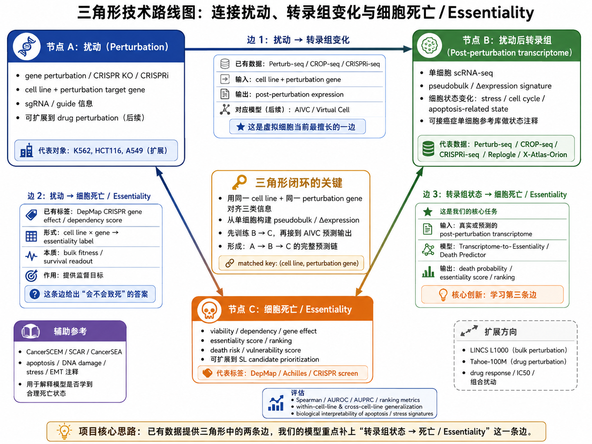
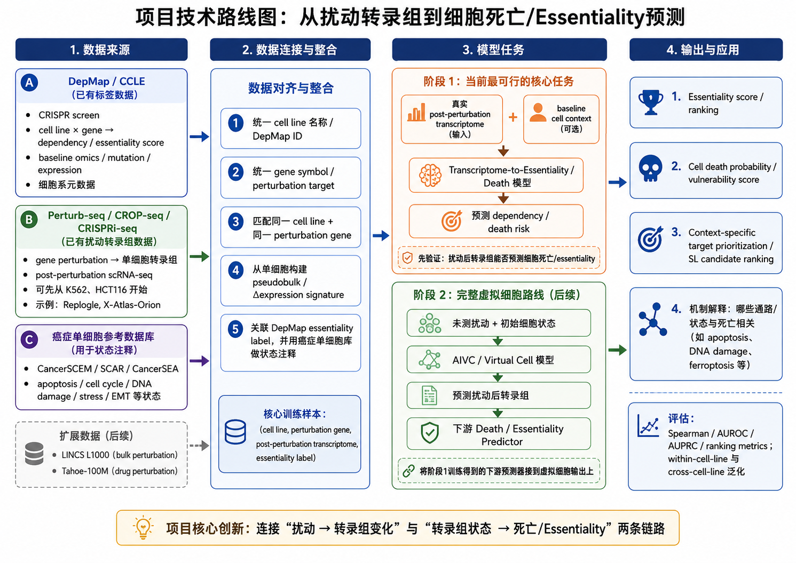

# Cancer Dependency Prediction from Perturbation-Induced Transcriptomes

This project connects virtual-cell perturbation modeling with cancer dependency and
synthetic-lethality target prioritization. The core question is:

> Given a cancer cell line and a gene perturbation, can the post-perturbation
> transcriptomic response predict whether that perturbation creates a meaningful
> fitness, vulnerability, or dependency phenotype?

The current framing is deliberately narrower than "predict synthetic lethality"
end-to-end. DepMap/Achilles CRISPR gene-effect scores provide population-level
dependency labels, not single-cell death labels and not strict SL labels. The
project first learns the link from perturbation-induced transcriptomic response
to cancer dependency, then uses context specificity to prioritize SL-like
candidates.



## Project Definition

The project is organized around a three-node chain:

1. **Perturbation**: cell line plus perturbation target gene, usually CRISPRi or
   CRISPR knockout for the first supervised setting.
2. **Post-perturbation transcriptome**: observed or predicted scRNA-seq response,
   represented as pseudobulk delta expression, top-DE signatures, pathway
   activity, or learned embeddings.
3. **Dependency / essentiality phenotype**: DepMap-style gene-effect score,
   vulnerability score, or target ranking for the same cell line and gene.

The current supervised task is:

```text
(cell line, perturbation gene, post-perturbation transcriptomic response)
    -> DepMap CRISPR gene-effect / dependency score
```

The matched key is **(cell line, perturbation gene)**. All data integration should
preserve that key explicitly.

## Technical Roadmap



### Stage 1: Observed Response to Dependency

Use real post-perturbation transcriptomes from Perturb-seq / CROP-seq /
CRISPRi-seq and align them to DepMap/Achilles labels. This stage avoids relying
on an imperfect forward perturbation model.

Primary proof-of-concept:

- start with K562 where CRISPRi Perturb-seq resources are strongest;
- extend to HCT116, A549, or other cancer cell lines only when cell-line and
  perturbation-gene identifiers can be aligned cleanly;
- prioritize CRISPRi or knockout data for DepMap CRISPR gene-effect alignment;
- treat Norman CRISPRa as a useful perturbation-response reference, not as the
  primary label-aligned dataset for knockout dependency prediction.

Current implemented baseline:

```bash
uv run vcc-dep-baseline build-features --config configs/replogle_k562_baseline.yaml
uv run vcc-dep-baseline run-cv --config configs/replogle_k562_baseline.yaml
uv run vcc-dep-baseline summarize --results-dir /home/richard/projects/VCC/results/replogle_k562_b_to_c_baseline/cv
```

This baseline builds gene-level Replogle K562 delta-expression features from
`obs["gene"]`, excludes matched rows whose DepMap GeneEffect is missing, and
evaluates repeated stratified cross-validation against continuous K562
CRISPRGeneEffect labels. It reports simple controls, ridge / elastic-net, PCA
ridge, and tabular nonlinear baselines before any MIL or foundation-model
embeddings, with both unweighted and square-root-`n_cells`-weighted fits where
the estimator supports sample weights.

`run-cv` now emits explicit evaluation scopes:

- `internal_cv_all`: the full Replogle internal repeated stratified CV.
- `internal_cv_target_index_valid`: a separate repeated stratified CV restricted
  to rows with `target_gene_index >= 0`, comparing only `delta_all` and
  `delta_mask_target`.
- `external:<name>`: optional external holdout reports produced from configured
  aligned feature packs, evaluated with the exact model instances trained on
  each `internal_cv_all` fold.

### Stage 2: Virtual-Cell Extension

After Stage 1 establishes that transcriptomic response contains dependency
signal, connect a forward perturbation model:

```text
basal cancer cell state + candidate perturbation
    -> predicted post-perturbation transcriptome
    -> dependency / essentiality predictor
    -> target ranking
```

Candidate forward models may include scGPT, GEARS, STATE, or simple additive /
linear baselines. The point is to quantify whether predicted transcriptomes are
good enough for downstream dependency ranking, not to assume that forward
prediction is solved.

### Stage 3: SL Candidate Prioritization

Synthetic lethality requires context specificity. A gene that is essential in a
cell line is not automatically synthetic lethal. SL-like prioritization should
add one or more context filters:

- mutation or copy-number background;
- lineage or cancer-type specificity;
- normal-cell or less-vulnerable cancer-cell contrast;
- pathway-specific dependency evidence;
- TCGA/CCLE/DepMap context metadata.

## Data Sources and Roles

| Source | Role | Notes |
| --- | --- | --- |
| Perturb-seq / CROP-seq / CRISPRi-seq | Mechanistic response input | Provides post-perturbation scRNA-seq, pseudobulk signatures, or delta expression. |
| DepMap / Achilles / CCLE | Supervision and context | Provides CRISPR gene-effect scores, dependency labels, omics, lineage, and mutation context. |
| CancerSCEM / SCAR / CancerSEA | State annotation | Used for apoptosis, stress, cell-cycle, EMT, DNA-damage, or other cancer-state interpretation. |
| TCGA / patient omics | Disease context | Useful for biomarker-specific framing and translational interpretation after cell-line proof-of-concept. |
| LINCS L1000 / Tahoe-100M | Later extensions | Useful for bulk or drug perturbation expansion after the gene-perturbation task is stable. |

Minimum useful aligned training record:

```text
cell_line_id
perturbation_gene_id
perturbation_modality
control_expression
post_perturbation_expression
delta_expression_or_embedding
depmap_gene_effect_score
cell_line_context_metadata
```

## Evaluation

Use continuous dependency prediction as the default target. Binary essential /
non-essential labels can be derived later, but threshold choices should be
reported explicitly.

Recommended metrics:

- Spearman or Pearson correlation for gene-effect regression;
- mean squared error or mean absolute error for calibrated score prediction;
- AUROC / AUPRC if using binary essentiality labels;
- ranking metrics for top-k target prioritization;
- within-cell-line and cross-cell-line generalization splits;
- biological interpretation of high-scoring targets and response programs.

## Current Repository State

This `main` branch has been cleaned of legacy VCC training code and old reports.
It currently serves as a project framing and rebuild base.

Project assets:

- `README.md`: human-facing project overview and roadmap.
- `AGENTS.md` / `CLAUDE.md`: instructions for AI coding agents.
- `docs/discussion/0408.md`: 2026-04-08 project discussion notes.
- `docs/discussion/0429.md`: 2026-04-29 project discussion notes.
- `docs/data/`: concise dataset cards for downloaded Stage 1 data.
- `docs/images/core.png`: triangular technical framing diagram.
- `docs/images/roadmap.png`: staged project roadmap diagram.
- `configs/replogle_k562_baseline.yaml`: Replogle K562 B→C baseline config.
- `src/vcc_dependency_baseline/`: feature building and CV baseline package.
- `tests/`: synthetic-data tests for the baseline package.
- `data/norman/splits/`: retained Norman split metadata.
- `scGPT/`: local scGPT reference code.
- `pyproject.toml` / `uv.lock`: Python environment metadata.

The old `src_tahoe/`, `scripts/`, and historical result folders were removed
from `main`. Do not document or rely on old `uv run vcc` or `uv run vcc-tahoe`
pipeline commands.

## Environment

This repository uses `uv` with a project-local `.venv`.

```bash
uv python install 3.11
uv sync
uv run python -c "import anndata, scanpy, torch, scgpt; print('environment ok')"
```

Use `uv run` for Python tooling:

```bash
uv run ruff check .
uv run ruff format .
uv run python -m pytest
uv run vcc-dep-baseline build-features --config configs/replogle_k562_baseline.yaml
```

Tests may be absent while the implementation is being rebuilt. If no tests are
present, document that explicitly in the change summary instead of treating the
test command as a successful verification step.

## Terminology Guardrails

- Say **dependency prediction** or **essentiality ranking** for the supervised
  DepMap task.
- Say **SL candidate prioritization** only after adding context-specificity
  evidence.
- Do not call DepMap gene-effect scores single-cell death labels.
- Do not equate gene essentiality with synthetic lethality.
- Do not directly align CRISPRa activation perturbations with CRISPR knockout
  dependency labels without an explicit modality caveat.
