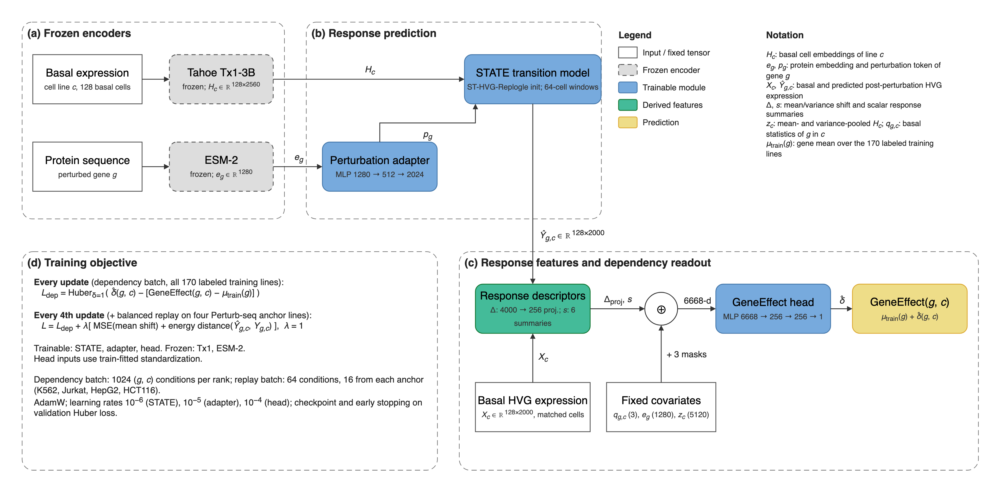

# Experiment Protocol: Held-Out-Cell-Line GeneEffect Prediction

Updated 2026-09-07. This is the executable protocol for the **implemented** GeneEffect
track under [the research blueprint](01-blueprint.md) §3–§4 and §6; the
[joint-training design](specs/2026-09-06-modular-joint-training-design.md) is its
implementation specification and the [runbook](../hpc/README.md) its operator guide.
One run has completed: seed 0, trained, tested and baselined
([result](results/joint_geneeffect_seed0/README.md)). The
[SL ranking protocol](04-sl-ranking-protocol.md) builds on this backbone; nothing here
is SL evidence.

## 1. Objective and prediction unit

For a held-out cell line $c$ and gene $g$, predict the DepMap GeneEffect $y_{g,c}$
from the basal single-cell transcriptome of $c$ and the protein sequence of $g$.
The model predicts the residual over a fixed training gene mean,

$$
\hat y_{g,c}=\mu_{\text{train}}(g)+\hat\delta(g,c),\qquad
\mu_{\text{train}}(g)=\operatorname{mean}_{c\in\mathcal C_{\text{train}}}y_{g,c},
$$

so that the context-blind term is fixed preprocessing and the residual is the
quantity under test. The generalization axis is the cell line, not the gene. No
GeneEffect measurement of $c$ enters the deployable feature path. GeneEffect is a
single-gene dependency: it is not an SL label and estimates no genetic interaction.

The question this protocol answers is whether a perturbation-response model learns
context information that improves held-out-line dependency prediction beyond the
gene mean and simple context predictors. It is a diagnostic for the backbone, scored
on its own benchmark, and does not substitute for the SL protocol's pair evaluation.

## 2. Benchmark

The [fixed split](../configs/benchmarks/cell_line_geneeffect_226_split.json) is the
sole membership authority; the [data card](data/cell-line-geneeffect-226.md)
documents its construction.

| Cohort | Members | Labeled | Role |
| --- | ---: | ---: | --- |
| train | 172 | 170 | supervised fitting; PC9 and HeLa have no 26Q1 GeneEffect row |
| validation | 27 | 27 | once-per-epoch evaluation, checkpoint selection, early stopping |
| test | 27 | 27 | one-shot final evaluation |

All 47 original basal/SL-context union lines are fixed in train; the 179 atlas lines
follow a patient-grouped partition in which no PatientID crosses sides and GeneEffect
values did not determine membership. Every fit passes through the split's eligibility
guard; the two unlabeled train members are declared explicitly, and any other missing
label is a hard error. The 226-line benchmark and the nine-context SL split never
substitute for each other.

**The seed-0 test has been observed.** Further model decisions use validation only;
a changed model or objective does not license a second look at test as a selection
surface. Membership changes require a new benchmark version.

## 3. Inputs and supervision

### 3.1 Basal cells

Use the exact registered model's basal cells as raw UMI counts, never CPM: Tx1 does not
read CPM like the counts underneath it, and the shift survives pooling
([measured](results/exp13_stage0/README.md)). Select up to 128 basal cells per line
deterministically, without replacement, from the recorded preparation seed; a line with
fewer cells keeps all of them. Frozen Tx1-3B embeddings of these cells are cached once
at preparation time with their pretraining and preprocessing provenance.

### 3.2 Response anchors

| ModelID | Cell line |
| --- | --- |
| ACH-000551 | K562 |
| ACH-000971 | HCT116 |
| ACH-000995 | Jurkat |
| ACH-000739 | HepG2 |

All four are labeled training members. Use genetic-perturbation responses and
non-targeting controls; a response condition need not carry a GeneEffect observation.
A fixed 10% of each anchor's response conditions (holdout seed 13) contributes no
response targets to optimization and is scored at validation and test. Response
holdout is condition holdout on training lines, not cell-line or unseen-gene holdout.

### 3.3 Dependency labels

Use the pinned DepMap 26Q1 GeneEffect release joined by ModelID. Fit the gene mean,
the variable-gene set and all normalization on the 170 labeled training lines only,
store them in the checkpoint and restore them for every later evaluation. The common
evaluation gene panel is prepared once from label availability; test values never
enter preparation or fitting. Missing labels stay masked.

### 3.4 Preparation

Prepare fixed inputs once, in a single process, under the configured `prepared_root`:
Tx1 basal-embedding cache, per-gene basal statistics $q_{g,c}$, ESM-2 table, response
cache with gene order and the common gene panel. Training opens these caches and never
rebuilds them; a missing cache is an error, not a trigger.

## 4. Model



*(a) Frozen Tx1-3B encodes 128 sampled basal cells of line $c$ into
$H_c\in\mathbb{R}^{128\times2560}$ and frozen ESM-2 encodes gene $g$ into
$e_g\in\mathbb{R}^{1280}$; both are cached at preparation time. (b) A trainable adapter maps
$e_g$ to the perturbation token $p_g\in\mathbb{R}^{2024}$, and the trainable STATE transition
model, initialised from the ST-HVG-Replogle checkpoint and run on 64-cell windows, predicts
post-perturbation HVG expression $\hat Y_{g,c}\in\mathbb{R}^{128\times2000}$. (c) Response
descriptors compare $\hat Y_{g,c}$ with the matched basal HVG expression $X_c$: the 4000-d
mean/variance shift $\Delta$ is reduced to 256 dimensions by one fixed seeded projection,
plus six scalar summaries $s$. Concatenated with the fixed covariates $q_{g,c}$ (3 basal
statistics of $g$ in $c$), $e_g$ and $z_c$ (mean- and variance-pooled $H_c$, 5120-d) and
three coverage masks, the 6668-d vector feeds the residual head, an MLP 6668 → 256 → 256 → 1
over train-fitted standardised blocks. (d) The joint objective of §5. Source:
[`figures/geneeffect_architecture.drawio`](../figures/geneeffect_architecture.drawio);
vector exports sit beside it.*

Expression changes subtract basal and predicted bags in the same 2000-gene output
space; $H_c$ and $\hat Y_{g,c}$ have different widths and are never subtracted.
Cell distributions are supervised without pairing an individual control cell to an
individual perturbed cell. The STATE checkpoint load reports loaded and newly
initialised layers once; unexpected incompatibilities are errors. Coverage masks
declare whether $q_{g,c}$, the HVG-panel membership of $g$ and the own-gene shift are
available; nothing is zero-filled.

## 5. Training and selection

One joint loop. Every optimizer update minimizes the mean GeneEffect Huber loss
(delta 1) on $\hat\delta$ against $y-\mu_{\text{train}}$; updates 0, 4, 8, … add a
balanced response batch:

$$
L_t=L_{GE}+\mathbf{1}[t\bmod4=0]\,\lambda\,\big(L_{\text{mean-shift MSE}}+L_{\text{energy distance}}\big),\qquad \lambda=1.
$$

| Setting | Value |
| --- | --- |
| Dependency conditions per rank / replay conditions per rank | 1024 / 64, 16 per anchor |
| Learning rates STATE / adapter / head | $10^{-6}$ / $10^{-5}$ / $10^{-4}$ |
| Optimizer, weight decay, gradient clipping | AdamW, 0.01, 1.0 |
| Maximum epochs, validation patience | 50, 5 |
| Cell bag, STATE window | 128 cells, 64 cells |
| Training, cell-collation, projection base seeds | 0, 0, 0 |

Feature scales are initialised before the first update from up to 32 finite
dependency conditions per labeled training line, in evaluation mode on training data
only, and stored in the checkpoint. Validate exactly once at the end of every
completed epoch over all 27 validation lines and the held-out response conditions,
reporting the fields of the joint design §4. **Only minimum `val_geneeffect_loss`
selects `best.pt` and controls early stopping**; total loss, response loss and
correlations are reported diagnostics. Resume happens at epoch boundaries with the
checkpoint's configuration; a batch-size change needs a new run id and a documented
derived checkpoint, and produces a mixed continuation, not an ablation.

## 6. Evaluation

Test is an explicit command on the selected checkpoint; training never runs it. It
restores the fitted preprocessing without refitting and exports predictions, metrics
and per-line, per-gene and response tables for the requested split. The blueprint's
[metric definitions](01-blueprint.md#6-what-the-geneeffect-metrics-measure) apply:
Huber, RMSE and MAE over observed pairs; absolute Pearson/Spearman across genes within a
line, macro-averaged over lines; residual Pearson/Spearman across lines for each
train-defined variable gene, macro-averaged over genes; and response mean-shift MSE
and energy distance averaged within, then equally across, the four anchors.

The control ladder is fitted on labeled training lines only and scored on identical
observed keys: gene mean, K562 copy-prior, nearest line (HVG and Tx1 features) and
context-PCA ridge (HVG and Tx1 features). Residual targets are centred on the
fold-fit gene mean excluding the scored line; predictions are centred on the
fold-independent mean. Centring a prediction on the fold-fit mean scores Spearman 1.0
by construction and is forbidden. Gene-mean and copy-prior have **undefined** residual
correlations because their per-gene predictions are constant across lines; report
scored and undefined counts, never zeros.

A context claim requires residual correlation above the contextual controls, not high
absolute correlation, which the gene mean already achieves. Response improvement alone
establishes neither dependency nor SL improvement.

## 7. Leakage and integrity rules

- Validation and test lines are absent from the gene mean, variable-gene selection,
  normalization, feature-scale initialisation, response supervision and every
  hyperparameter or checkpoint decision.
- Join lines by DepMap ModelID through the checked-in map; never by informal name.
- Per-line z-scoring of predictions is forbidden; it consumes the held-out line's own
  distribution and erases the quantity under test.
- The config validator raises on unknown, missing or out-of-domain keys and hard-codes
  the selector, seeds, HVG width and holdout seeds; checkpoint loads report loaded
  keys and raise on zero. A complete-looking wrong artifact, not an exception, is the
  dominant failure mode.
- Qualify every held-out-line result by the Tx1 Tahoe-100M pretraining exposure of
  the evaluated lines.
- Test is one-shot per benchmark version; the seed-0 test is spent.

## 8. Required outputs

```text
outputs/geneeffect_joint/<run_id>/
  config.yaml
  run.json                     source revision, inputs, environment, seeds, statuses
  metrics.jsonl                one record per epoch
  last.pt, best.pt             weights, fitted preprocessing, counters, rank RNG states
  evaluation/<ckpt>/<split>/   predictions.parquet, metrics.json, per_line.csv,
                               per_gene.csv, response.csv
  baselines/<split>/           the same exports for every control
```

A result note under [`results/`](results/) names the run id, the commit the code ran
at, the checkpoint SHA-256, the selected epoch, the observed-key count shared by all
methods and the full comparison table. Planned numbers are not results.

## 9. Current state

| Test method | Huber ↓ | Absolute Pearson ↑ | Residual Pearson ↑ | Residual Spearman ↑ |
| --- | ---: | ---: | ---: | ---: |
| Joint best.pt, epoch 3 | 0.01611905 | 0.91050 | 0.05414 | 0.05280 |
| Gene mean | 0.01613152 | 0.91047 | undefined | undefined |
| Context-PCA ridge, Tx1 | 0.01625512 | 0.90983 | 0.12161 | 0.11574 |
| Context-PCA ridge, HVG | 0.01635306 | 0.90920 | 0.07736 | 0.08324 |

Seed 0 improves on the gene mean by 0.0773% Huber and trails both contextual ridge
baselines on residual correlation. Epochs 1–2 ran at batch 256 per rank and 3–8 at
1024, a mixed continuation. This is a working training and evaluation path, not a
context-modelling advantage. Next decisions use validation: a matched-batch
response-weight 0 versus 1 comparison and residual-scale diagnostics
([full result](results/joint_geneeffect_seed0/README.md)).
