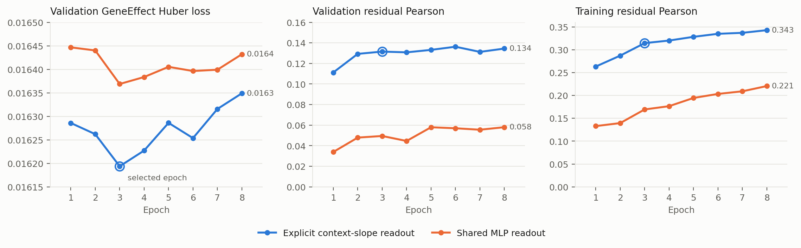

# Experiment Protocol: Held-Out-Cell-Line GeneEffect Prediction

Updated 2026-09-09. This is the executable protocol for the **implemented** GeneEffect
track under [the research blueprint](01-blueprint.md) §3–§4 and §6; the
[joint-training design](specs/2026-09-06-modular-joint-training-design.md) is its
implementation specification and the [runbook](../hpc/README.md) its operator guide.
One run has completed: seed 0, trained, tested and baselined
([result](results/joint_geneeffect_seed0/README.md)). The current best model is that
backbone frozen under an explicit gene-specific context-slope head (§7, validation
only). A numeric-space defect in response preparation was found and corrected; after the
correction the response pathway learns the cell lines it is adapted on but does not
transfer to a held-out line
(§8, [result](results/p1_response_pathway_diagnostics/README.md)). The
[SL ranking protocol](04-sl-ranking-protocol.md) builds on this backbone; nothing here
is SL evidence.

## 1. Objective and prediction unit

For a held-out cell line $c$ and gene $g$, predict the DepMap GeneEffect $y_{g,c}$
from the basal single-cell transcriptome of $c$ and the protein sequence of $g$.
The model predicts the residual over a fixed training gene mean,

$$
\hat y_{g,c}=\mu_{\text{train}}(g)+\hat\delta(g,c),\qquad
\mu_{\text{train}}(g)=\operatorname{mean}_{c\in\mathcal C_{\text{train}}}y_{g,c},
$$

so that the context-blind term is fixed preprocessing and the residual is the
quantity under test. The generalization axis is the cell line, not the gene. No
GeneEffect measurement of $c$ enters the deployable feature path. GeneEffect is a
single-gene dependency: it is not an SL label and estimates no genetic interaction.

The question this protocol answers is whether a perturbation-response model learns
context information that improves held-out-line dependency prediction beyond the
gene mean and simple context predictors. It is a diagnostic for the backbone, scored
on its own benchmark, and does not substitute for the SL protocol's pair evaluation.

## 2. Benchmark

The [fixed split](../configs/benchmarks/cell_line_geneeffect_226_split.json) is the
sole membership authority; the [data card](data/cell-line-geneeffect-226.md)
documents its construction.

| Cohort | Members | Labeled | Role |
| --- | ---: | ---: | --- |
| train | 172 | 170 | supervised fitting; PC9 and HeLa have no 26Q1 GeneEffect row |
| validation | 27 | 27 | once-per-epoch evaluation, checkpoint selection, early stopping |
| test | 27 | 27 | one-shot final evaluation |

All 47 original basal/SL-context union lines are fixed in train; the 179 atlas lines
follow a patient-grouped partition in which no PatientID crosses sides and GeneEffect
values did not determine membership. Every fit passes through the split's eligibility
guard; the two unlabeled train members are declared explicitly, and any other missing
label is a hard error. The 226-line benchmark and the nine-context SL split never
substitute for each other.

## 3. Inputs and supervision

### 3.1 Basal cells

Use the exact registered model's basal cells as raw UMI counts, never CPM: Tx1 does not
read CPM like the counts underneath it, and the shift survives pooling
([measured](results/exp13_stage0/README.md)). Select up to 128 basal cells per line
deterministically, without replacement, from the recorded preparation seed; a line with
fewer cells keeps all of them. Frozen Tx1-3B embeddings of these cells are cached once
at preparation time with their pretraining and preprocessing provenance.

### 3.2 Response anchors

| ModelID | Cell line |
| --- | --- |
| ACH-000551 | K562 |
| ACH-000971 | HCT116 |
| ACH-000995 | Jurkat |
| ACH-000739 | HepG2 |

All four are labeled training members. Use genetic-perturbation responses and
non-targeting controls; a response condition need not carry a GeneEffect observation.
A fixed 10% of each anchor's response conditions (holdout seed 13) contributes no
response targets to optimization and is scored at validation and test. Response
holdout is condition holdout on training lines, not cell-line or unseen-gene holdout.

### 3.3 Dependency labels

Use the pinned DepMap 26Q1 GeneEffect release joined by ModelID. Fit the gene mean,
the variable-gene set and all normalization on the 170 labeled training lines only,
store them in the checkpoint and restore them for every later evaluation. The common
evaluation gene panel is prepared once from label availability; test values never
enter preparation or fitting. Missing labels stay masked.

### 3.4 Preparation

Prepare fixed inputs once, in a single process, under the configured `prepared_root`:
Tx1 basal-embedding cache, per-gene basal statistics $q_{g,c}$, ESM-2 table, response
cache with gene order and the common gene panel. Tx1 reads raw counts (§3.1); the
response model does not. Control bags and response targets that enter the STATE
transition model are transformed at preparation into that model's own numeric space,
log1p of library-normalised counts (target 3,500 over the HVG panel), and the transform
is recorded in the prepared bundle so that the loss, the references and the identity
derangements are computed in the same space. Training opens these caches and never
rebuilds them; a missing cache is an error, not a trigger.

## 4. Model

*(a) Frozen Tx1-3B encodes 128 sampled basal cells of line $c$ into
$H_c\in\mathbb{R}^{128\times2560}$ and frozen ESM-2 encodes gene $g$ into
$e_g\in\mathbb{R}^{1280}$; both are cached at preparation time. (b) A trainable adapter maps
$e_g$ to the perturbation token $p_g\in\mathbb{R}^{2024}$, and the trainable STATE transition
model, initialised from the ST-HVG-Replogle checkpoint and run on 64-cell windows, predicts
post-perturbation HVG expression $\hat Y_{g,c}\in\mathbb{R}^{128\times2000}$. (c) Response
descriptors compare $\hat Y_{g,c}$ with the matched basal HVG expression $X_c$: the 4000-d
mean/variance shift $\Delta$ is reduced to 256 dimensions by one fixed seeded projection,
plus six scalar summaries $s$. Concatenated with the fixed covariates $q_{g,c}$ (3 basal
statistics of $g$ in $c$), $e_g$ and $z_c$ (mean- and variance-pooled $H_c$, 5120-d) and
three coverage masks, the 6668-d vector feeds the residual head, an MLP 6668 → 256 → 256 → 1
over train-fitted standardised blocks. (d) The joint objective of §5. 

Expression changes subtract basal and predicted bags in the same 2000-gene output
space; $H_c$ and $\hat Y_{g,c}$ have different widths and are never subtracted.
Cell distributions are supervised without pairing an individual control cell to an
individual perturbed cell. The STATE checkpoint load reports loaded and newly
initialised layers once; unexpected incompatibilities are errors. Coverage masks
declare whether $q_{g,c}$, the HVG-panel membership of $g$ and the own-gene shift are
available; nothing is zero-filled.

## 5. Training and selection

One joint loop. Every optimizer update minimizes the mean GeneEffect Huber loss
(delta 1) on $\hat\delta$ against $y-\mu_{\text{train}}$; updates 0, 4, 8, … add a
balanced response batch:

$$
L_t=L_{GE}+\mathbf{1}[t\bmod4=0]\,\lambda\,\big(L_{\text{mean-shift MSE}}+L_{\text{energy distance}}\big),\qquad \lambda=1.
$$

| Setting | Value |
| --- | --- |
| Dependency conditions per rank / replay conditions per rank | 1024 / 64, 16 per anchor |
| Learning rates STATE / adapter / head | $10^{-6}$ / $10^{-5}$ / $10^{-4}$ |
| Optimizer, weight decay, gradient clipping | AdamW, 0.01, 1.0 |
| Maximum epochs, validation patience | 50, 5 |
| Cell bag, STATE window | 128 cells, 64 cells |
| Training, cell-collation, projection base seeds | 0, 0, 0 |

Feature scales are initialised before the first update from up to 32 finite
dependency conditions per labeled training line, in evaluation mode on training data
only, and stored in the checkpoint. Validate exactly once at the end of every
completed epoch over all 27 validation lines and the held-out response conditions,
reporting the fields of the joint design §4. **Only minimum `val_geneeffect_loss`
selects `best.pt` and controls early stopping**; total loss, response loss and
correlations are reported diagnostics. Resume happens at epoch boundaries with the
checkpoint's configuration; a batch-size change needs a new run id and a documented
derived checkpoint, and produces a mixed continuation, not an ablation.

## 6. Evaluation

Evaluate the selected checkpoint in `eval()` mode without gradients, restoring its
fitted preprocessing. Train and validation use their own observed cell-line/gene
pairs and the same train-defined variable-gene set. Let $y_{cg}$ be the observed
GeneEffect, $\mu_g$ the fitted training gene mean, $r_{cg}=y_{cg}-\mu_g$ the target
residual and $\hat r_{cg}$ the predicted residual.

### Residual Pearson ↑

For each variable gene, compute Pearson correlation across cell lines, then take
an equal-weight mean over genes with defined correlations:

$$
\rho_g=\operatorname{Pearson}_c(r_{cg},\hat r_{cg}),\qquad
\rho_{\mathrm{macro}}=\frac{1}{|G_\rho|}\sum_{g\in G_\rho}\rho_g.
$$

This measures how well predictions follow gene-specific context variation.
The reported set contains 4,447 train-defined variable genes. Correlations use
pairwise-finite observations; undefined correlations are excluded and counted.
Absolute Pearson in Section 7 instead correlates across genes within each line,
then averages over lines.

### SD ratio

For each variable gene, divide prediction SD by target residual SD across the
same pairwise-finite cell lines, then average the defined ratios equally:

$$
q_g=\frac{\operatorname{SD}_c(\hat r_{cg})}{\operatorname{SD}_c(r_{cg})},\qquad
q_{\mathrm{macro}}=\frac{1}{|G_q|}\sum_{g\in G_q}q_g.
$$

SD uses `ddof=0`. A ratio below 1 indicates shrinkage; 1 indicates matching
amplitude. Fewer than two observations or zero target SD makes the ratio
undefined; zero prediction SD with positive target SD gives zero. Section 7.4
reports the median and percentiles of these per-gene ratios instead of the mean.

### GeneEffect Huber ↓

For $e_{cg}=\hat r_{cg}-r_{cg}$, use Huber loss with $\delta=1$:

$$
\ell(e)=\begin{cases}
\tfrac12 e^2,& |e|\le1,\\
|e|-\tfrac12,& |e|>1,
\end{cases}
\qquad
L_{\mathrm{GE}}=\frac{1}{|\Omega|}\sum_{(c,g)\in\Omega}\ell(e_{cg}).
$$

$\Omega$ contains all finite labeled pairs in the split, including genes outside
the variable-gene set. Each pair has equal weight. Adding the same fitted gene
mean to predictions and targets leaves this loss unchanged. It excludes response
loss; minimum validation GeneEffect Huber selects `best.pt`.

## 7. Results

The best model to date is the selected seed-0 joint backbone, frozen, read out by a
residual head that adds an explicit gene-specific context slope to the §4 MLP:

$$
\hat\delta(g,c)=\mathrm{MLP}(F_{g,c})+w_g^{\top}u_c,
$$

where $u_c$ holds the first eight principal components of the pooled Tx1 context
embedding $z_c$, fitted on training lines, and $w_g\in\mathbb{R}^8$ is one zero-initialised,
L2-regularised slope per training-covered gene. The head sees only the direct features
(context embedding, gene embedding, basal covariates and masks); the backbone's
response block is excluded. Selection follows §5. The model is validation-selected and
carries **no test number**: the test split was spent once on the backbone (§7.3) and
has not been opened for any readout. Provenance and full tables:
[readout and response diagnostics](results/p1_response_pathway_diagnostics/README.md).

### 7.1 Learning curves

*Figure 1. Readout training on the frozen backbone, head seed 0, one point per epoch.
Left: validation GeneEffect Huber loss, the selection criterion; the ring marks the
selected epoch. Middle and right: validation and training residual Pearson, macro
means over the 4,447 train-defined variable genes. Both readouts start from identical
MLP weights and see identical cached features; the explicit slope is the only
difference.*

The explicit slope reaches a validation residual Pearson above 0.11 after one epoch and
0.13 by the selected third epoch; the shared MLP never exceeds 0.06. Training residual
Pearson keeps rising to 0.34 with no further validation gain, so the readout fits
gene-by-context structure that does not transfer beyond what the first epochs capture.
The backbone's own curves are recorded with the
[joint result](results/joint_geneeffect_seed0/README.md).

### 7.2 Validation comparison with controls

All methods share the same 479,084 observed cell-line/gene pairs over the 27 validation
lines and the same variable-gene set; readouts consume identical cached features.

| Validation method | Huber ↓ | Absolute Pearson ↑ | Residual Pearson ↑ | Residual Spearman ↑ | SD ratio |
| --- | ---: | ---: | ---: | ---: | ---: |
| **Explicit context slope, direct features** | 0.01619 | 0.9103 | 0.1315 | 0.1270 | 0.189 |
| Explicit context slope, direct features + response block | 0.01620 | 0.9102 | 0.1280 | 0.1240 | 0.186 |
| Shared MLP, direct features | 0.01637 | 0.9093 | 0.0495 | 0.0515 | 0.093 |
| Shared MLP, direct features + response block | 0.01637 | 0.9093 | 0.0496 | 0.0479 | 0.127 |
| Joint backbone readout, as trained | 0.01632 | 0.9094 | 0.0404 | 0.0439 | 0.093 |
| Context-PCA ridge on Tx1 (eight components) | 0.01628 | 0.9097 | 0.1330 | 0.1233 | 0.273 |
| Gene mean | 0.01632 | 0.9094 | undefined | undefined | 0 |

Paired bootstrap over the 27 validation lines (1,000 resamples): the explicit slope
improves residual Pearson over the shared MLP by +0.082 [0.058, 0.105] and over the
joint readout by +0.091 [0.066, 0.115]; it is indistinguishable from the context-PCA
ridge, −0.002 [−0.015, 0.016], while predicting with smaller amplitude. Adding the
response block changes nothing under either readout (+0.000 [−0.020, 0.016] and
−0.004 [−0.010, 0.003]). Two further head initialisations reproduce the explicit-slope
result at 0.133 and 0.134 with the same gain over the shared MLP. Huber differences are
of order $10^{-4}$: the context signal is small against the gene-mean block.

This is a validation-only readout result on a backbone trained before the numeric-space
correction of §8. It licenses no context-modelling claim beyond an eight-component
linear context baseline and no SL claim.

### 7.3 Backbone test record

The joint backbone (seed 0, selected at epoch 3) was evaluated once on the test split
with its baselines; the test split is spent and has not been used to choose or score
any readout. Epochs 1–2 ran at batch 256 and epochs 3–8 at 1,024, a documented mixed
continuation ([full result](results/joint_geneeffect_seed0/README.md)).

| Test method | Huber ↓ | Absolute Pearson ↑ | Residual Pearson ↑ | Residual Spearman ↑ |
| --- | ---: | ---: | ---: | ---: |
| Joint backbone, selected epoch | 0.01612 | 0.9105 | 0.0541 | 0.0528 |
| Gene mean | 0.01613 | 0.9105 | undefined | undefined |
| Context-PCA ridge, Tx1 | 0.01626 | 0.9098 | 0.1216 | 0.1157 |
| Context-PCA ridge, HVG | 0.01635 | 0.9092 | 0.0774 | 0.0832 |
| Nearest line, Tx1 | 0.02869 | 0.8458 | 0.0608 | 0.0597 |
| Nearest line, HVG | 0.02854 | 0.8460 | 0.0590 | 0.0613 |
| K562 copy-prior | 0.03390 | 0.8169 | undefined | undefined |

The backbone improves on the gene mean by 0.08% Huber and trails both contextual ridge
baselines on residual correlation.

### 7.4 Prediction diagnostics

The backbone's test predictions are strongly shrunk and low-rank. The median per-gene
ratio of prediction spread to true residual spread is 5.8%, against 25.3% for the Tx1
ridge; the first singular direction of the centred prediction matrix carries 59% of its
energy, against 43% for the ridge and 11% for the true residuals; and the ridge has the
higher per-gene correlation on 60% of variable genes. On training lines the backbone
reaches residual Pearson 0.165 with SD ratio 0.126, falling to 0.040 and 0.093 on
validation. Weak context correlation and heavy shrinkage are already present in the fit;
generalisation loses the rest.

## 8. Where the model stalls: response-pathway diagnostics

Three closed diagnostics on the selected backbone locate the bottleneck. Designs are
under [`specs/`](specs/); evidence and provenance are in the
[result note](results/p1_response_pathway_diagnostics/README.md). All are validation
only, single training seed, and none is SL evidence.

**Numeric-space correction.** The seed-0 backbone was trained with control bags and
response targets cached as raw UMI counts, whereas the STATE checkpoint of §4 expects
library-normalised, log-transformed expression. Its response block therefore made no
detectable use of perturbation identity and scored about 21 times the no-change
reference on its own anchors' held-out conditions. Preparation now transforms both
inputs and targets into the decoder's space (§3.4). Under the corrected preparation the
released checkpoint, untrained, beats no-change on HepG2 and Jurkat and uses
perturbation identity for 22–66% of its loss; it remains 25% above no-change on K562 and
fails on HCT116 at every scale, a platform mismatch for that anchor rather than a scale
issue. The results below are from the corrected preparation.

**No interface transfers across cell lines.** With the backbone otherwise frozen, four
interfaces between the Tx1 context representation and the response model were adapted
on three anchors and scored on the fourth, in leave-one-anchor-out folds, first in the
original count space and then in the decoder's own space. The table reports the ratio
of response loss to the no-change reference on the held-out anchor; the untrained
released checkpoint is the reference row.

| Held-out response loss / no-change, expression space | Jurkat | K562 | HepG2 | HCT116 | pooled [95%] |
| --- | ---: | ---: | ---: | ---: | --- |
| Released checkpoint, native inputs, untrained | 0.95 | 1.25 | 0.92 | 7.8 | — |
| Adapted Tx1 interface (new basal encoder into the STATE skip) | 17.6 | 32.9 | 20.5 | 32.0 | 25.7 [25.3, 26.2] |
| Expression-residual interface (effect added to known basal expression) | 1.01 | 1.22 | 0.98 | 1.15 | 1.088 [1.086, 1.091] |
| Native basal path, ESM-2 perturbation tokens | 1.01 | 1.63 | 1.02 | 11.9 | 3.88 [3.81, 3.95] |
| Native basal path with a trainable Tx1 context term | 6.0 | 12.7 | 11.5 | 11.7 | 10.5 [10.3, 10.7] |

Every interface learns its three source anchors, most below no-change, yet none meets
the pre-registered keep rule on the held-out line. Two regularities emerge. First, the
held-out error grows with how much of STATE's basal skip is trained on Tx1 input: the
full new encoder fails by 18–33 times, an additive context term by 6–13 times, and the
native path with nothing trained there sits at parity. The Tx1-conditioned term learns a
per-context offset that does not exist for an unseen line. Second, the
expression-residual interface, which routes known basal expression around that skip,
removes the failure entirely but transfers no effect: it uses perturbation identity for
only 2–3% of its held-out loss and is matched or beaten by a constant global-mean shift
on three of four lines. The count-space repetition gives the same ordering with larger
failures (pooled 17.3, 1.031, 18.2 and 12.0), and interface learning rate is monotone but
does not change the picture.

**The readout is not the limit.** The explicit context slope of §7 lifts validation
residual Pearson from 0.05 to 0.13 at three head initialisations, ties an
eight-component linear context baseline, and gains nothing from the response block
under either readout. The context information reachable through the pooled Tx1 embedding
is low-rank, and the response block adds none because the response pathway that feeds
it does not generalise. A readout on response features from the corrected pathway has not
been trained; on the transfer evidence above it is not expected to move the residual
correlation.

**Bottleneck.** The GeneEffect residual is small against the gene mean and is sampled
on 170 training lines, so gene-by-context parameters overfit within three epochs; the
pooled Tx1 context carries about as much usable signal as eight principal components;
and the perturbation-response model, meant to supply mechanism, does not transfer to a
cell line outside its adaptation set with three usable anchors. Progress requires either
a response model that holds up on a held-out line or a richer context representation;
further head engineering on the present features cannot move the residual correlation.

**Scope of the records.** Diagnostics run before the correction are retained as the
record of the defect and are never pooled with corrected runs. The backbone's test
record in §7.3 predates the correction and stands as the GeneEffect record; its response
losses carry no response-quality meaning. Any re-training of the joint backbone follows
the corrected preparation of §3.4.
