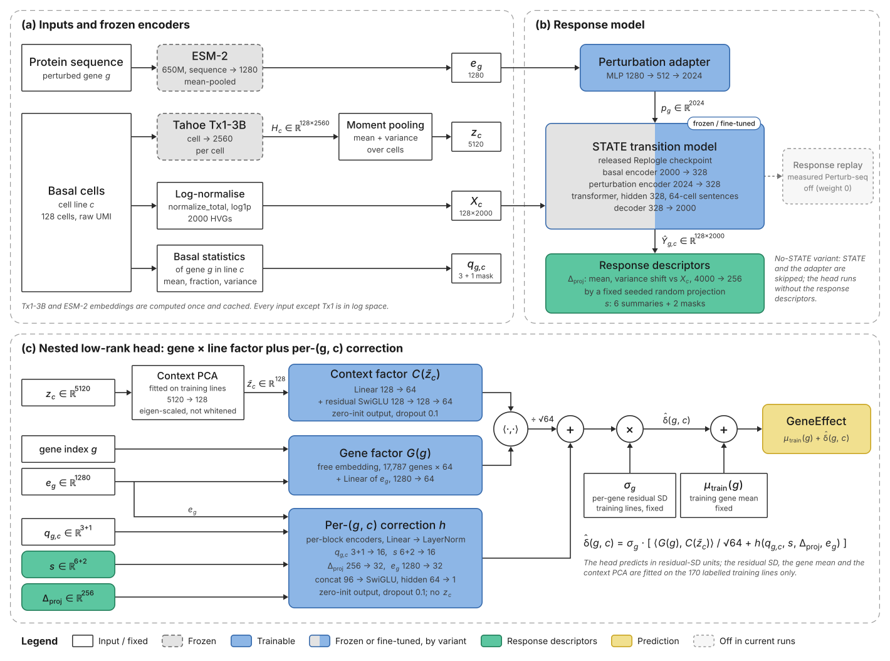
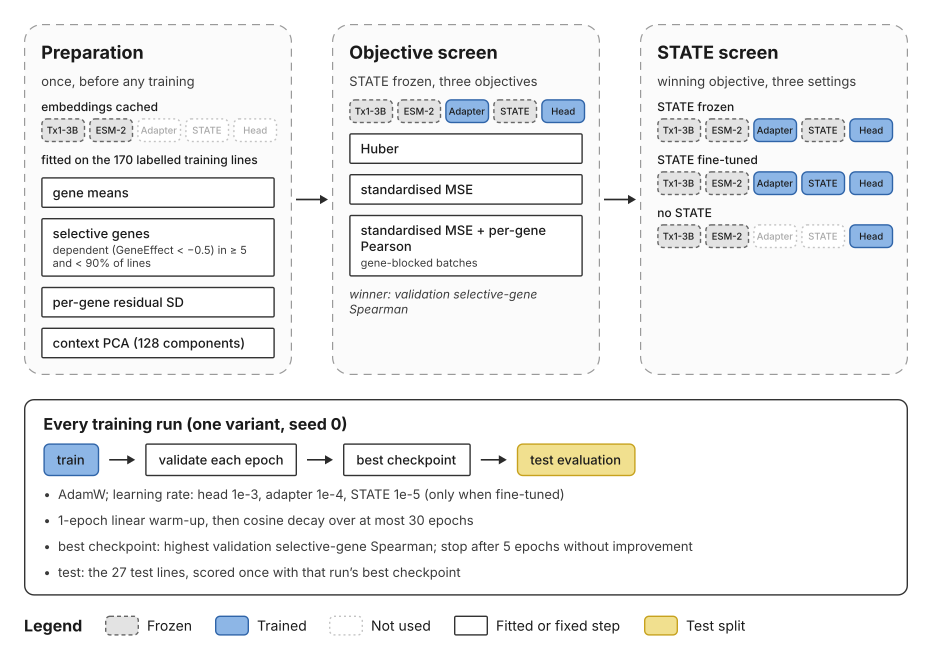
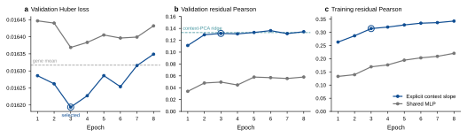
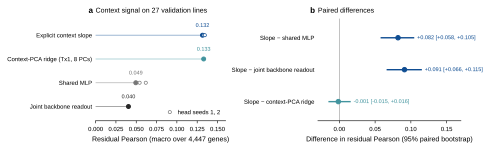
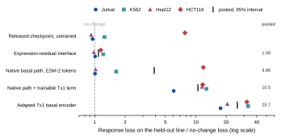

# Experiment Protocol: Held-Out-Cell-Line GeneEffect Prediction

Updated 2026-10-04. This is the protocol for the **implemented** GeneEffect track under
[the research blueprint](01-blueprint.md); it holds the rules (§11), the model, expression space, training,
metrics and results. The design behind the current wiring is the
[expression-space and `all`-run design](specs/2026-10-02-expression-space-and-all-pipeline-design.md),
and operating commands are in the [runbook](../hpc/README.md). One run has completed: seed 0,
trained, tested and baselined ([result](../results/joint_geneeffect_seed0/README.md)). It
predates the expression-space change of §3.4 (STATE was fed raw counts) and its numbers are
not compared like for like with the current pipeline. The best validation model to date is
that backbone frozen under an explicit gene-specific context-slope head (§7, validation
only). Response-pathway diagnostics (§8, [result](../results/p1_response_pathway_diagnostics/README.md))
found that the response pathway learns the cell lines it is adapted on but does not
transfer to a held-out line; §9 specifies the comparison that measures what STATE adds and
the single command that runs the whole pipeline. The 2026-10-03
[revision](specs/2026-10-03-geneeffect-revision-design.md) replaced the joint model's head, objective,
selection rule and STATE treatment (§4–§6, §9.3): §4–§6 state the current rules, while §7 and §8 are
historical records of earlier runs under the earlier head and Huber selection. The
[SL ranking protocol](04-sl-ranking-protocol.md) builds on this backbone; nothing here
is SL evidence. §10 specifies the linear context prior, a CPU control that the joint model is
compared against.

## 1. Objective and prediction unit

For a held-out cell line $c$ and gene $g$, predict the DepMap GeneEffect $y_{g,c}$
from the basal single-cell transcriptome of $c$ and the protein sequence of $g$.
The model predicts the residual over a fixed training gene mean,

$$
\hat y_{g,c}=\mu_{\text{train}}(g)+\hat\delta(g,c),\qquad
\mu_{\text{train}}(g)=\operatorname{mean}_{c\in\mathcal C_{\text{train}}}y_{g,c},
$$

so that the context-blind term is fixed preprocessing and the residual is the
quantity under test. The generalization axis is the cell line, not the gene. No
GeneEffect measurement of $c$ enters the deployable feature path. GeneEffect is a
single-gene dependency: it is not an SL label and estimates no genetic interaction.

The question this protocol answers is whether a perturbation-response model learns
context information that improves held-out-line dependency prediction beyond the
gene mean and simple context predictors. It is a diagnostic for the backbone, scored
on its own benchmark, and does not substitute for the SL protocol's pair evaluation.

## 2. Benchmark

The [fixed split](../configs/benchmarks/cell_line_geneeffect_226_split.json) is the
sole membership authority; the [data card](data/cell-line-geneeffect-226.md)
documents its construction.

| Cohort | Members | Labeled | Role |
| --- | ---: | ---: | --- |
| train | 172 | 170 | supervised fitting; PC9 and HeLa have no 26Q1 GeneEffect row |
| validation | 27 | 27 | once-per-epoch evaluation, checkpoint selection, early stopping |
| test | 27 | 27 | one-shot final evaluation |

All 47 original basal/SL-context union lines are fixed in train. The 179 atlas lines
follow a patient-grouped partition: no patient's lines are split across cohorts, and
GeneEffect values did not determine membership. The 226-line benchmark and the
nine-context SL split never substitute for each other.

## 3. Inputs and supervision

### 3.1 Basal cells

Use each line's basal cells as raw UMI counts, never CPM: Tx1 does not read CPM the way
it reads the counts underneath, and the shift survives pooling
([measured](../results/exp13_stage0/README.md)). A fixed random sample of up to 128 basal
cells per line is encoded once by the frozen Tx1-3B foundation model; the same cells,
in the expression space of §3.4, are STATE's basal input.

### 3.2 Response anchors

Four labeled training lines carry genetic-perturbation response data: K562, HCT116,
Jurkat and HepG2, joined by DepMap ModelID. Use genetic-perturbation responses and
non-targeting controls; a response condition need not carry a GeneEffect observation.
Response supervision is an auxiliary task that fine-tunes STATE: it uses all conditions of
all four anchors and withholds no condition. The 27 GeneEffect validation lines (§2) are the
only validation split, so the response task has no held-out score inside training; its
held-out behaviour is measured by the comparison of §9.

### 3.3 Dependency labels

Use the pinned DepMap 26Q1 GeneEffect release, joined by ModelID. Fit the gene mean, the
variable-gene set, the selective-gene set and per-gene residual SD of §4 and §6, and all
normalization on the 170 labeled training lines only, and
reuse them unchanged in every later evaluation. Test values never enter preparation or
fitting. Missing labels stay missing.

### 3.4 Expression space

Every expression quantity except Tx1's input uses one space, the one STATE's released
checkpoint was trained in (arc-state `preprocess_train`): normalise each cell's library to
a target total $T$, take $\log(1+\cdot)$, then slice STATE's 2,000 highly variable genes
(HVGs):

$$
x^{\text{log}}_{ig}=\log\!\Big(1+\frac{T\,x_{ig}}{L_i}\Big),\qquad L_i=\sum_{g'}x_{ig'}\ \text{over all genes of the cell's source matrix.}
$$

- $T$ is the median library size of the non-targeting cells in the Nadig 2025 Jurkat and
  HepG2 response sources, the data STATE's Replogle checkpoint was trained on. It is
  computed once at preparation, recorded in the prepared manifest as `expression_space`,
  and never configured.
- Library size is taken over **all** genes of each source matrix, not over the HVG panel.
  This is a known approximation: gene universes differ slightly between the Nadig,
  Replogle, X-Atlas-Orion and atlas matrices.
- Tx1 keeps raw UMI counts (§3.1). The transform covers STATE's basal bags for all 226
  lines, the response targets and anchor control bags, the basal statistics $q_{g,c}$
  (mean and variance; detected fraction is space-invariant), and the HVG features of the
  context baselines (§6).
- Preparation refuses a source matrix that is already normalised, and loading refuses a
  prepared root without `expression_space`, so a raw-count cache cannot reach STATE.

## 4. Model

*Figure 1. (a) Frozen Tx1-3B encodes the sampled basal cells of line $c$ from raw counts into
cell embeddings that are moment-pooled into a context embedding; frozen ESM-2 encodes gene $g$.
Both are computed once and cached. The same cells in log-normalised HVG expression (§3.4) are
STATE's basal input. (b) A trainable adapter turns the gene embedding into a perturbation
token. The STATE transition model, initialised from a published Replogle checkpoint, reads the
log-normalised basal cells through its own released basal encoder and predicts the line's
post-perturbation expression; it is frozen or fine-tuned by variant (`train.state_mode`), and
the no-STATE variant skips STATE and the adapter. Response replay to measured Perturb-seq is
drawn dashed: it is off in the current runs. Response descriptors summarise how predicted
expression differs from basal expression. (c) The nested low-rank head: a gene factor $G(g)$
(free per-gene embedding plus a linear map of $e_g$) meets a line factor $C(\tilde z_c)$ read
from the training-line context PCA alone, and a per-(g, c) correction $h$ reads the basal
statistics, the response descriptors and $e_g$ but never the context; their sum, scaled by
the fixed per-gene residual SD $\sigma_g$, is $\hat\delta$, and the training gene mean is added
for the GeneEffect prediction. Tx1 feeds only the head; it does not enter
STATE. Arrows carry the tensors passed between modules, shaped for one gene–line condition
(cells × features, no batch dimension); boxes state the width change inside each module. The
adapter emits 2024 values because that is the width of STATE's perturbation vocabulary; STATE
projects it, like the 2000-wide expression input, to its hidden size of 328. Notation: $H_c$,
Tx1 cell embeddings of line $c$; $e_g$ and $p_g$, the gene embedding and the perturbation token;
$X_c$ and $\hat Y_{g,c}$, basal and predicted post-perturbation log expression; $\Delta$ and $s$,
the projected expression shift and scalar response summaries; $q_{g,c}$, basal statistics of $g$
in $c$; $z_c$, the pooled context embedding; $\mu_{\text{train}}(g)$, the training gene mean;
$\hat\delta$, the predicted residual. The training protocol is Figure 2 in §5.*

Figure 1 shows the data flow and the nested head defined below. Tx1 is frozen and supplies cached basal-cell embeddings. STATE and an
ESM2 adapter predict perturbed expression, and the head uses five feature blocks: pooled
expression change $\Delta$ (projected), response dispersion statistics $s$, gene-specific basal
single-cell statistics $q_{g,c}$, gene embedding $e_g$ and the compressed basal context
$\tilde z_c$. $\Delta$, $s$, $q_{g,c}$ and $e_g$ are standardised per dimension with statistics
fitted on training rows, each partial-coverage value paired with an explicit mask bit. The gene
mean $\mu_{\text{train}}$ is fixed preprocessing, not a learned head.

**Context PCA.** The pooled Tx1 context $z_c$ (5120 = mean and variance of the 2560-d cell
embeddings) takes only 170 distinct values in training, one per labelled training line, so its
rank is at most 169 (z-scored, 90% of its variance lies in 86 components). It is therefore
compressed before the head: z-scored per dimension and projected onto its first 128 principal
components (`model.context_components`), all fitted on the labelled training lines only, saved in
the checkpoint and restored at evaluation. The scores are divided by one constant, the SD of the
first component's scores, so the leading component has unit variance and the tail keeps its
smaller scale (eigen-scaled, not whitened); $\tilde z_c$ bypasses the per-dimension standardiser.

**Nested low-rank head.** The head is a rank-$r$ gene $\times$ line product plus a per-(g, c)
correction, rescaled by a fixed per-gene residual scale $\sigma_g$:

$$
\hat\delta(g,c)=\sigma_g\Big[\tfrac{1}{\sqrt r}\,\big\langle G(g),\,C(\tilde z_c)\big\rangle+h\big(q_{g,c},\,s,\,\Delta,\,e_g\big)\Big],\qquad
G(g)=E_g+W e_g,\qquad C(\tilde z)=A\tilde z+\mathrm{SwiGLU}_C(\tilde z).
$$

$E\in\mathbb R^{|\mathcal G|\times r}$ is a free per-gene embedding (normal, SD 0.02) indexed by
the gene's position in the fixed gene order and $W$ a linear map of $e_g$ to $\mathbb R^r$, with
$r=64$ (`model.factor_rank`). $C$ reads only the line context: a linear map $A$ (128 → $r$) plus a
residual branch (SwiGLU 128 → 128, dropout, linear 128 → $r$) whose output layer starts at zero.
With $C=A\tilde z$ the first term is a reduced-rank regression on the context components, the form
of the Tx1 context-PCA ridge, so training starts from the strongest control's model class.
$h$ encodes each enabled block separately (linear then LayerNorm: $q$ with its mask → 16, $s$ with
its masks → 16, $\Delta$ → 32, $e_g$ → 32), concatenates them, applies dropout and a SwiGLU layer of
width 64, and ends in a zero-initialised linear map to one value; it never sees the context.
SwiGLU is $(\mathrm{SiLU}(xW_1)\odot xW_2)W_3$. Dropout is 0.1 (`model.dropout`). The layer widths are
fixed in code. There is no per-line lookup anywhere: the only per-line signal is $\tilde z_c$
and, through STATE, the basal cells. This head replaced a trunk MLP over all five blocks plus a
gene $\times$ context product (2 hidden layers of 256, raw 5120-d $z_c$; 4.46M parameters, 1.33M
now), which reached a training-diagnostic selective Spearman of 0.53–0.67 against 0.15 on
validation ([head revision design](specs/2026-10-03-geneeffect-head-revision-design.md)).

$\sigma_g$ is the population SD of the residual $y_{cg}-\mu_{\text{train}}(g)$ over the labeled
training lines, floored at its 10th percentile over genes
(`features.residual_sd_floor_percentile`); a gene with fewer than two labeled training lines takes
the floor. It is fitted on training lines only, saved in the checkpoint, and applied for every
objective, so the head works in units of $\sigma_g$ and $\hat\delta$, the losses in residual
units and every metric use the rescaled prediction.

**STATE settings.** STATE is (a) frozen at the released weights with only the ESM2 adapter
trained, (b) trainable with the adapter (`train.state_mode`: `frozen` or `trainable`), or (c)
absent: with `head_blocks.use_delta_proj` and `use_s` both false the model never calls STATE
or the adapter, and the head is the same network without the $\Delta$ and $s$ blocks.

Predicted and basal expression are compared in one shared gene space, the 2,000 log-space
HVGs of §3.4; basal Tx1 embeddings and predicted expression have different widths and are
never subtracted. Cell distributions are supervised as distributions, without pairing
individual control and perturbed cells. Covariates that are unavailable for a gene or line
are masked, never zero-filled.

## 5. Training and selection

*Figure 2. Training protocol. Preparation fits the gene means, the selective genes and the
per-gene residual SD on training lines once; Tx1-3B and ESM-2 stay frozen throughout. The
objective screen trains the adapter and head with STATE frozen; the STATE screen compares STATE
frozen, STATE fine-tuned and no STATE (head only) under the winning objective. Every run is one
config at seed 0: train, validate each epoch, keep the best checkpoint, then score it once on
test.*

A single joint training loop runs. Every update minimizes one GeneEffect objective
(`train.objective`) on $\hat\delta$ against $r_{cg}=y_{cg}-\mu_{\text{train}}(g)$, with
$e_{cg}=\hat\delta_{cg}-r_{cg}$ and $\sigma_g$ of §4:

| Objective | Loss | Batches |
| --- | --- | --- |
| `huber` | Huber ($\delta=1$) of $e_{cg}$, in residual units | 1024 random rows per rank |
| `standardized_mse` | $\operatorname{mean}\,(e_{cg}/\sigma_g)^2$ | 1024 random rows per rank |
| `pearson_blocks` | $\operatorname{mean}\,(e_{cg}/\sigma_g)^2+\operatorname{mean}_{g\in B}\big(1-\operatorname{Pearson}_c(\hat\delta_{cg}/\sigma_g,\,r_{cg}/\sigma_g)\big)$ | every training line of 6 genes per update (`train.genes_per_block`) |

In the blocked objective $B$ is the set of selective genes (§6) of the batch that have at
least three rows and a non-constant target there; with no such gene the term is zero. Each
epoch deals a seeded permutation of the genes in blocks round-robin to the ranks and drops the
incomplete tail, so every rank takes the same number of updates. All losses are computed in
FP32.

Response replay is optional. Every fourth update (`response_interval`; 0, 4, 8, …), only when
`train.response_weight`$\,=\lambda>0$, a response batch of 64 conditions balanced across the four
anchors (K562, HepG2, Jurkat, HCT116) and sampled from all of their conditions is added:

$$
L_t=L_{\text{GE}}+\mathbf{1}[t\bmod4=0]\,\lambda\,\big(L_{\text{mean-shift MSE}}+L_{\text{energy distance}}\big).
$$

The base config has $\lambda=0$, so no response batch is drawn and the joint model uses
response data for nothing; a model without STATE cannot replay at all. Earlier runs used
$\lambda=1$ and Huber only.

AdamW (weight decay 0.05, `train.weight_decay`) has up to three parameter groups, each present only when its module
is trained: the head, including the gene embedding and the context tower, at $10^{-3}$; the
ESM2 adapter at $10^{-4}$ when STATE is used; and STATE at $10^{-5}$, only under `trainable`
(a frozen STATE has no gradient and runs without dropout). The learning rate rises linearly
over the first epoch of updates (`warmup_epochs` 1) and then follows a cosine to zero at the
last of at most 30 epochs, stepped per update. Training, cell-collation and projection base
seeds are all 0. Settings are fixed in `configs/geneeffect_joint.yaml`, and
`configs/revision/` holds one config per objective with STATE frozen. The loop follows the
joint-training design (`docs/specs/2026-09-06-modular-joint-training-design.md`, removed; `git show 1694f5c:<path>`); the
[expression-space design](specs/2026-10-02-expression-space-and-all-pipeline-design.md) set its
response wiring, basal path and validation splits and the
[revision design](specs/2026-10-03-geneeffect-revision-design.md) its head, objectives,
learning rates, schedule and selection.

Validation runs once per completed epoch over the 27 validation lines, the only validation
split. **Only the maximum validation selective-gene Spearman (§6) selects `best.pt` and
controls early stopping** (patience 5, at most 30 epochs); an undefined selector stops the run
rather than counting as a loss. Each epoch also scores 27 fixed training lines, chosen as
the validation split's size, as a telemetry curve (`train_eval_`): the fit is observed, never
gated. Test restores the checkpoint's preprocessing without refitting or optimizer updates;
the seed-0 test has been observed once and must not become a tuning or checkpoint-selection
surface. Runs before the revision selected on minimum validation GeneEffect Huber loss (§7).

## 6. Evaluation

Evaluate the selected checkpoint with the training-side gene mean, gene sets, residual
scale and normalization restored. Train and validation use their own observed cell-line/gene
pairs and the same train-defined variable-gene and selective-gene sets. Let $y_{cg}$ be the observed GeneEffect, $\mu_g$ the
fitted training gene mean, $r_{cg}=y_{cg}-\mu_g$ the target residual and $\hat r_{cg}$
the predicted residual.

### Selective-gene Spearman ↑ (selection criterion)

A gene is **selective** when it has a dependent tail among the labeled training lines but is
not essential almost everywhere. With dependent meaning $y_{cg}<-0.5$, let $n_g$ be the number
of labeled training lines that depend on $g$ and $m_g$ the number of labeled training lines:

$$
\mathcal G_{\mathrm{sel}}=\{\,g:\ n_g\ge5\ \text{and}\ n_g/m_g<0.9\,\},
\qquad
\rho^{\mathrm{S}}_g=\operatorname{Spearman}_c(r_{cg},\hat r_{cg}),\qquad
\rho^{\mathrm{S}}_{\mathrm{macro}}=\frac{1}{|G_{\mathrm{S}}|}\sum_{g\in G_{\mathrm{S}}}\rho^{\mathrm{S}}_g,
$$

where $G_{\mathrm{S}}\subseteq\mathcal G_{\mathrm{sel}}$ holds the genes with a defined
correlation. The set is fitted on training lines only
(`features.selective_min_lines`, `features.selective_max_fraction`) and stored with the
checkpoint; on the current split it has 3,111 genes, with 1,004 commonly essential genes
excluded ([design](specs/2026-10-03-geneeffect-revision-design.md) §2). The per-gene gene mean is
constant, so $\rho^{\mathrm S}_g$ is the rank correlation of the predicted and observed
GeneEffect of gene $g$ across lines (the centring rules below apply). Undefined correlations are
excluded and counted. This quantity is the selection criterion of §5
(`val_selective_spearman`).

**Why this metric.** The intended SL computation is statistical and cohort-based
(DAISY, ISLE and SLIdR style): for a gene pair $(a,b)$, test whether lines in which $b$ is lost
or low depend more strongly on $a$. That is a rank test on gene $a$'s dependency across lines,
so what it consumes is the per-gene ranking of lines, concentrated on genes that have a
dependent tail. Selective-gene Spearman measures that ranking directly, whereas the pooled
Huber loss is dominated by high-variance genes and rewards shrinkage
([design](specs/2026-10-03-geneeffect-revision-design.md) §1). It is a GeneEffect diagnostic
chosen for this alignment: no SL computation runs here and it is not SL evidence.

### Selective AUPR lift ↑

For each selective gene with at least one dependent and at least one non-dependent labeled
line in the evaluated split, rank lines by predicted GeneEffect, lowest first, and take the
average precision for the dependent lines minus the prevalence $\pi_g$ of dependent lines:

$$
\mathrm{lift}_g=\mathrm{AP}_g\big(\mathbf 1[y_{cg}<-0.5],\,-\hat y_{cg}\big)-\pi_g,
$$

so a constant prediction scores exactly 0. The macro mean is over the scored genes; scored and
undefined counts are reported. Selective Spearman and AUPR lift are computed identically for
every control below. A paired bootstrap resamples the evaluated lines with replacement, the
same draw for both models, and recomputes each model's macro selective Spearman to give an
interval for the difference between two models (1,000 resamples, seed 0, in the `revision`
summary against the Tx1 context-PCA ridge).

### Residual Pearson ↑

For each variable gene, compute Pearson correlation across cell lines, then take
an equal-weight mean over genes with defined correlations:

$$
\rho_g=\operatorname{Pearson}_c(r_{cg},\hat r_{cg}),\qquad
\rho_{\mathrm{macro}}=\frac{1}{|G_\rho|}\sum_{g\in G_\rho}\rho_g.
$$

This measures how well predictions follow gene-specific context variation. The reported
set contains 4,447 train-defined variable genes; undefined correlations are excluded
and counted. A context-blind predictor, such as the gene mean, is constant per gene, so
its residual correlation is undefined rather than zero.

### SD ratio

For each variable gene, divide prediction SD by target residual SD across cell lines,
then average the defined ratios equally:

$$
q_g=\frac{\operatorname{SD}_c(\hat r_{cg})}{\operatorname{SD}_c(r_{cg})},\qquad
q_{\mathrm{macro}}=\frac{1}{|G_q|}\sum_{g\in G_q}q_g.
$$

A ratio below 1 indicates shrinkage; 1 indicates matching amplitude.

### GeneEffect Huber ↓

For $e_{cg}=\hat r_{cg}-r_{cg}$, use Huber loss with $\delta=1$:

$$
\ell(e)=\begin{cases}
\tfrac12 e^2,& |e|\le1,\\
|e|-\tfrac12,& |e|>1,
\end{cases}
\qquad
L_{\mathrm{GE}}=\frac{1}{|\Omega|}\sum_{(c,g)\in\Omega}\ell(e_{cg}).
$$

$\Omega$ contains all labeled pairs in the split, including genes outside the
variable-gene set, each with equal weight, scored on the rescaled prediction $\hat r$ of §4.
It excludes response loss. It was the selection criterion before the revision and is now
telemetry beside the selective-gene metrics.

### Further metrics and controls

Let $\mathcal C_{eval}$ be the evaluated lines and $\mathcal G_{var}$ the train-defined
variable-gene set (4,447 genes in the seed-0 run); the residual metrics above and below use
this set, the selective metrics $\mathcal G_{\mathrm{sel}}$. Only finite observed labels are scored.

| Metric | Calculation | Interpretation |
| --- | --- | --- |
| RMSE, MAE | Error over all observed gene–line pairs | Accuracy, including prediction scale |
| Absolute Pearson/Spearman | For each line, correlate $\hat y$ and $y$ across genes; average lines equally | Cross-gene dependency ranking within a line |
| Residual Spearman | As residual Pearson, with rank correlation | Context variation for the same gene |

Residual and absolute correlations differ in the **axis of correlation**, not in
centering: for a fixed gene, subtracting its fixed mean does not change Pearson. Targets
are centred on the fold-fit training mean $\mu_g^{(-c)}$ and predictions on the
fold-independent $\bar\mu_g$; centring a prediction on the fold-fit mean scores Spearman
$+1$ by construction. Constant predictions have undefined correlation: gene-mean and
copy-prior residual correlations stay missing, with scored and undefined counts reported,
never zero-filled.

Every model is compared on identical observed keys with the controls fitted on training
lines only: gene mean, K562 copy prior, nearest line, and context-PCA ridge on both the Tx1
embedding and the log-space HVG mean and variance features (§3.4). High absolute
correlation alone cannot establish context learning, and response improvement alone cannot
establish dependency improvement.

## 7. Results

Sections 7 and 8 record runs made before the revision of §4–§6: they used the shared MLP
head without the gene $\times$ context product, Huber selection and, in §7.0, raw-count STATE
input. They are historical and are not recomputed under the selective-gene metrics.

### 7.0 Seed-0 joint backbone

The seed-0 joint run completed eight epochs and selected epoch 3 (stored index 2). Epochs
1–2 used batch 256 per rank and epochs 3–8 continued at 1024, a mixed-batch continuation,
not a batch ablation. Test and all six baseline variants completed on 2026-09-07 with
identical 478,501 observed keys. STATE was fed raw counts in this run (§3.4), so the
numbers below predate the expression-space change.

| Test method | Huber ↓ | Absolute Pearson ↑ | Residual Pearson ↑ | Residual Spearman ↑ |
| --- | ---: | ---: | ---: | ---: |
| Joint best.pt | 0.01611905 | 0.91050 | 0.05414 | 0.05280 |
| Gene-mean | 0.01613152 | 0.91047 | undefined | undefined |
| Context-PCA-ridge, Tx1 | 0.01625512 | 0.90983 | 0.12161 | 0.11574 |
| Context-PCA-ridge, HVG | 0.01635306 | 0.90920 | 0.07736 | 0.08324 |

Joint Huber improves on gene-mean by only 0.0773%, while residual correlations trail the
context baselines. Response validation loss fell 45.57% from epoch 1 to 8 without
sustained GeneEffect validation improvement. This establishes a working training and
evaluation path, not a context-modelling advantage
([full result](../results/joint_geneeffect_seed0/README.md)).

The best model to date is the selected seed-0 joint backbone, frozen, read out by a
residual head that adds an explicit gene-specific context slope to the §4 head:

$$
\hat\delta(g,c)=\mathrm{MLP}(F_{g,c})+w_g^{\top}u_c,
$$

where $u_c$ holds the first eight principal components of the pooled Tx1 context
embedding, fitted on training lines, and $w_g$ is one regularised slope per
training-covered gene. The head sees the context embedding, gene embedding and basal
covariates; the backbone's response block is excluded. Selection followed minimum validation
Huber, the rule of that time (§5 now selects on selective-gene Spearman). The model
is validation-selected and carries **no test number**: the test split was spent once on
the joint backbone, which improved on the gene mean by 0.08% Huber and trailed the
context ridge baselines
([joint result](../results/joint_geneeffect_seed0/README.md)), and it has not been opened
for any readout. Provenance and the full numbers:
[readout and response diagnostics](../results/p1_response_pathway_diagnostics/README.md).
All result figures are drawn from tracked evidence by
[`plot_geneeffect_protocol.py`](figures/plot_geneeffect_protocol.py).

### 7.1 Learning curves

*Figure 2. Readout training on the frozen backbone, head seed 0, one point per epoch. (a)
Validation GeneEffect Huber loss, the selection criterion of that run; the ring marks the selected
epoch. (b) Residual Pearson over the 4,447 train-defined variable genes, validation
(solid) and training (dashed); the dotted line is the eight-component context-PCA ridge
on validation. Both readouts start from identical MLP weights and see identical cached
features; the explicit slope is the only difference.*

The explicit slope reaches the level of the linear context baseline within three epochs;
the shared MLP stays at less than half of it. Training correlation keeps rising with no
further validation gain, so the readout fits gene-by-context structure that does not
transfer. Validation Huber turns upward after the selected epoch while residual Pearson
holds.

### 7.2 Validation comparison with controls

*Figure 3. Four methods on the same 479,084 observed cell-line/gene pairs over the 27
validation lines; the readouts consume identical cached features. (a) Residual Pearson;
open circles are two further head initialisations. (b) Differences in residual Pearson
from the explicit slope, 1,000 paired bootstrap resamples of the 27 lines, 95%
intervals.*

The explicit slope recovers more than twice the context signal of the shared MLP and of
the joint backbone's own readout, and it reproduces at every head initialisation. It is
indistinguishable from the context-PCA ridge. It also lowers Huber loss the most (0.75%
below the gene mean, against 0.22% for the ridge), while predicting with smaller
amplitude than the ridge (SD ratio 0.19 against 0.27). Adding the backbone's response
block changes nothing under either readout (−0.003 [−0.010, +0.002] with the slope,
+0.000 [−0.020, +0.016] with the shared MLP).

This is a validation-only readout result on a backbone trained before the numeric-space
correction of §8. It licenses no context-modelling claim beyond an eight-component
linear context baseline and no SL claim.

## 8. Where the model stalls: response-pathway diagnostics

Three closed, validation-only diagnostics on the selected backbone locate the
bottleneck; designs are under [`specs/`](specs/) and evidence in the
[result note](../results/p1_response_pathway_diagnostics/README.md). The seed-0 backbone
was trained on response data cached as raw counts, whereas STATE expects log-normalised
expression, so its response block made no detectable use of perturbation identity. The diagnostics
below ran in STATE's log-normalised space, with library size approximated by scaling
HVG-panel row sums to a target (a proxy). The formal pipeline now normalises by the whole
library (§3.4).

*Figure 4. Four interfaces between the Tx1 context and the response model, each adapted on
three anchor lines and scored on the fourth. The x axis is the response loss on the
held-out line divided by the no-change reference; below 1 beats no-change. Markers are
held-out lines; the black tick is the pooled ratio, whose 95% interval is narrower than
the tick. The untrained released checkpoint is the reference row.*

No interface transfers to a held-out line. The more of STATE's basal pathway is trained
on Tx1 input, the larger the held-out error; the expression-residual interface avoids the
failure but carries almost no perturbation-specific effect. With the readout already at
the linear context baseline (§7.2), the bottleneck is upstream of the head: the pooled
Tx1 context holds about eight components of usable signal, and the response model does
not generalise beyond its three adaptation lines. Progress needs a response model that
holds up on a held-out line or a richer context representation.

## 9. Response-model comparison and the `all` run

The diagnostics of §8 never replaced STATE with a plain model on the same inputs, so the
value of STATE's transformer, and of Tx1 as a representation for the response task, is
unmeasured. The comparison below measures both, in the expression space of §3.4. The
design and its decisions are in the
[expression-space and `all`-run design](specs/2026-10-02-expression-space-and-all-pipeline-design.md).

### 9.1 Six-arm response-model comparison

Leave-one-anchor-out over the four anchors: each fold trains on all conditions of three
anchors and scores every condition of the fourth.

| Arm | Basal input | Response model | Trained |
| --- | --- | --- | --- |
| No-change | none | basal bag copied | no |
| Global mean effect | none | mean shift of the training anchors, gene-blind | no |
| Released STATE checkpoint | log HVG | released STATE with its one-hot gene vocabulary, scored on genes in that vocabulary | no |
| STATE as in the joint model | log HVG | STATE with the ESM2 adapter, joint learning rates | yes |
| MLP on log HVG | log HVG cell | $x+f([x;a(e_g)])$, final layer zero-initialised | yes |
| MLP on Tx1 | Tx1 cell embedding $h$ | $x+f([h;a(e_g)])$, final layer zero-initialised | yes |

Trained arms use AdamW (new layers $10^{-4}$, STATE $10^{-5}$), 50 fixed epochs with no early
stopping, balanced anchor sampling and seed 0. The response loss is the mean-shift MSE plus
energy distance of §5. The reported statistic is the held-out loss ratio to no-change at
the final epoch (below 1 beats no-change), per fold and pooled as the mean of the per-fold
ratios, over all four folds and over the three folds without HCT116, with one 95% interval
from a 1,000-resample bootstrap over perturbed genes (a gene drawn once moves every fold it
appears in). Identity share (loss increase under ten fixed gene shuffles, as a fraction of
loss), source-anchor training ratio and per-epoch held-out curves are reported for
reading only. Two verdicts: STATE as in the joint model against MLP on log HVG (what the
STATE transformer adds), and MLP on Tx1 against MLP on log HVG (what Tx1 adds as a
representation). A tie at no-change is an expected, informative outcome. The arm named STATE as in the joint
model uses the comparison config's learning rates (`comparison:` in the config) and trains on the
response loss alone; the revised joint model no longer replays response data by default (§5),
so the arm measures STATE fine-tuned on the response task, not the joint model's current
training. The comparison has
four contexts, and STATE's own pretraining exposure (K562, HepG2, Jurkat) qualifies every
result.

### 9.2 The `all` run

`hpc/run.sh all configs/geneeffect_joint.yaml [--gpus 0,1,2,3]` runs, skipping any step
whose output exists so that a rerun with the same run id resumes: preparation (Tx1 cache
reuse, one pass computing $T$, log-space bags, $q_{g,c}$ and response cache); the untrained
comparison arms on the first chosen GPU, including a sanity line scoring the released STATE
checkpoint on each anchor; joint training on every chosen GPU (every visible GPU unless
`--gpus` names some); the trained comparison arms, one job per arm and held-out anchor, one
job per chosen GPU at a time; validation evaluation of `best.pt`, the controls of §6 and the explicit
context-slope readout of §7 on the new backbone's cached features; and `summary.md`
(target total $T$, sanity line, comparison table and verdicts, validation table, with selective
Spearman and AUPR lift, for the joint model, readout and every control). `hpc/run.sh test CHECKPOINT` is the only route to
the test split; `all` never calls it, and the test split stays closed until a model beats
the context ridge by at least +0.02 residual Pearson, with an interval excluding 0, at each
of three training seeds.

Seed-0 numbers in §7 predate the expression-space change and are not compared like for
like with the `all` run. The readout objective and selection plan (`docs/specs/2026-09-10-readout-objective-and-selection-design.md`,
removed; `git show 1694f5c:<path>`) on the frozen backbone remains the follow-up for objective, selection and context
representation; the response model re-enters the feature path only once it beats no-change
on a held-out anchor.

### 9.3 The `revision` run

The `all` run `all_20261002T174946Z` finished. On validation the joint model of that run, with
the earlier head and Huber selection, reached residual Pearson 0.068 against 0.133 for the Tx1
context-PCA ridge, and the response comparison favoured the MLP on log HVG over fine-tuned
STATE and over the MLP on Tx1. The revision of
[the design](specs/2026-10-03-geneeffect-revision-design.md) answers that run with the head,
objectives, STATE settings and selection rule of §4–§6, and `hpc/run.sh revision CONFIG
[--run-id <id>] [--gpus 0,1,2,3]` runs one variant of it: preparation (returns at once on the
existing prepared root), joint training on every chosen GPU, evaluation of `best.pt` with the
controls of §6 on validation and then on test, and `summary.md` with `revision.json`. It runs
no response comparison and no readout; resume and run-directory rules are those of `all`.
`summary.md` holds, per split, one table (selective Spearman, selective AUPR lift, residual
Pearson over variable genes, Huber, SD ratio) for the joint model and every control and the
paired line bootstrap of selective Spearman for the joint model minus the Tx1 context-PCA
ridge, then the best epoch with its training-diagnostic and validation selective Spearman. One
config is one experiment at seed 0 (Figure 2); there is no multi-seed stage. Runs are screened
one at a time: the three objectives under frozen STATE, then the winning objective with
trainable STATE and with no STATE. A winner has the highest `val_selective_spearman` at its
`best.pt`; when two settings differ by less than the 27-line paired bootstrap interval, the
simpler is preferred (no STATE, then frozen, then trainable). Test numbers are reported for
every run and never used to choose. The screens are model selection, not SL evidence.

## 10. Linear context prior

The [context-generalization design](specs/2026-10-04-context-generalization-design.md) adds a
closed-form, CPU-only **linear context prior** that predicts the GeneEffect residual of §3.3 in
units of the per-gene residual SD from a line's expression alone. It is a control, not a
model of the joint pipeline: its own results table reports it beside the controls of §6, and the
single-cell correction that would stack on it is not built. The prior reads the shared expression space of the design (bulk TPM for bulk lines,
bridged pseudo-bulk for single-cell lines); the selective genes, $\hat\mu_g$ and $\sigma_g$ are
those of §3.3 and §6, fitted on the 170 labelled training lines, so every number stays on the
metrics of §6. A missing training label counts as a zero residual in fitting and is skipped in
scoring. Lines outside the 226 enter the training side under the rules of §11 and the
[data card](data/extra-bulk-lines-26q1.md).

`hpc/run.sh prior CONFIG [--run-id ID] [--experiments A,B]` runs a minimal experiment runner
(`src/experiments/context_prior.py`). The config names the paths, the training side (the
lineages dropped from the extra lines), the prior (component count, folds, bootstrap repeats,
data-selected genes), the penalty grids, the **block sets** (each starts with the expression
components and adds gene-level blocks: own expression, partner group, data-selected genes), a
`reference` experiment, and the **experiments**. An experiment is one bridge remedy (`kind`,
a module under `src/context_prior/remedies/`), a list of **settings** of that remedy, and the
block sets to fit under it. A run:

1. **Pseudo-bulk and the bridge inputs.** Preparation sums each line's raw UMI over all its basal
   cells, then CPM and log1p, into the prepared root; this is the only raw-data read. The shared
   space is the bulk genes every validation and test line's source measures (9,711); a training
   line lacking one takes the training lines' mean for it (counts in `facts.json`). Bulk and pseudo-bulk
   profiles are quantile-normalised to the mean sorted bulk profile of the training side.
2. **One bridge setting.** The remedy's `build` turns the normalised sources into the rows the prior
   is fitted on and the validation, test and oracle query rows. The reference remedy is one
   affine map per gene from normalised pseudo-bulk to normalised bulk, fitted on the training
   lines that have both; a gene whose range across lines is zero maps to its bulk mean. Bridge
   quality is the per-gene correlation across lines between out-of-fold bridged pseudo-bulk and
   bulk (five patient-grouped folds, seed 0; whatever a remedy learns, the bridge included, is
   refitted without the held fold), reported with counts above 0.3, 0.5 and 0.7 for
   all genes, the selective genes and their paralogs. The other remedies:
   - **contrastive PCA** projects the directions that only one source varies along
     (eigenvectors of the difference of the paired covariances) out of both sources, then
     bridges as the reference does;
   - **reliability gating** lets the gene-level blocks read only genes whose out-of-fold
     bridge quality reaches a threshold (`gene_space`; the data-selected block takes at most
     the space's other genes);
   - **noise-matched fitting** fits the gene-level blocks on the single-cell training lines'
     out-of-fold bridged pseudo-bulk, against the residual the components stage leaves on
     those rows (`gene_rows`);
   - **low-rank denoising** replaces the bridged validation and test rows by their projection
     on the leading components of the standardised training bulk.
3. **Fits and scores.** For every block set the prior is fitted on training lines only and scored
   on validation and test with the metrics of §6; the oracle row scores the validation lines'
   bulk RNA (off-contract: marked in every table, never a model or comparison row). Each row
   carries the selective-Spearman gain over the reference row with a 95% paired line-bootstrap
   interval (1,000 resamples, seed 0).

Every components penalty is a reported row, and a gene-level block set has a row for every
components and gene penalty pair: the components penalty sets how much residual the gene-level
stages fit, while the scale-free score barely separates components penalties on their own.
The reference row's components penalty, its best on validation, is the only choice in code.
Nothing is kept, dropped, passed or failed in code. Which setting, block set or extra-line
cohort to use is decided by reading the table.

Each setting writes `rows/<experiment>__<n>.json` and is skipped when the file exists, so a
rerun with the same run id resumes; `--experiments` restricts a process to the named
experiments, and two processes may share a run directory (rows are per setting). The run
directory is `outputs/context_prior/<run_id>/` and holds `run_config.json` (the config it is
bound to; a resume with another config is refused), `rows/`, and `results.md`, rewritten from
whatever rows exist: run facts, then per experiment one table with a line per setting, block
set and penalty (validation and test selective Spearman, gain over the reference with its
interval, selective AUPR lift, residual Pearson over variable genes, oracle validation
selective Spearman) and a bridge-diagnostics table per setting. One config is one run at seed
0. The prior is not SL evidence; a GeneEffect result estimates no genetic interaction.

The first runs (2026-10-04, [record](../results/context_prior_seed0/README.md)) used an earlier
runner that applied a learning-curve rule to the extra lines and kept blocks by bootstrap
interval; its code is gone. Read from its tables: without the 133 haematopoietic extras the
prior on all labelled lines beat the prior on the single-cell training lines (+0.051 [0.027, 0.069]
selective Spearman, bridged input), and the chosen config (expression components only) scored
0.223 on validation and 0.223 on test against 0.130 and 0.121 for the Tx1 context-PCA ridge.
Gene-level blocks did not survive the bridge (median per-gene bridge correlation 0.43). The
bridge-remedy run (2026-10-04, `configs/context_prior/bridge_remedies.yaml`,
[record](../results/bridge_remedies_seed0/README.md)) found no remedy above the reference on
validation, but it fitted gene-level blocks on the components-only penalty pick, and on bulk
input they add +0.0125 at components penalty 1. Its rerun over the full penalty grid
(`configs/context_prior/bridge_remedies_penalty_grid.yaml`, same record) puts the affine bridge with
all gene-level blocks at components penalty 1 and gene penalty 10 at 0.2300 validation / 0.2352 test,
+0.0068 [0.0011, 0.0129] and +0.0125 [0.0049, 0.0187] over components alone; no remedy beats the
affine bridge on validation.

## 11. Rules

The experiments follow the usual train, validation and test practice; these are the points
specific to this task.

- **Fit on training lines.** Gene means, variable and selective gene sets, residual SD,
  normalisation, context PCA, bridge, encoders and every fitted preprocessing use the labelled
  training lines only. Fit eligibility is checked against the split file.
- **Tune on validation.** Hyperparameters, penalties, checkpoints and the choice among settings
  use validation. Report validation and test for every row; one config is one run at seed 0, and
  `best.pt` is scored on test once. The seed-0 joint-model test split has been observed, so
  later model decisions rest on validation.
- **Experiment code reports; people decide.** Code computes and tabulates; it holds no pass,
  fail, keep or drop rule beyond hyperparameter tuning on validation.
- **Query lines supply basal single cells only.** No GeneEffect or SL measurement of a query
  line is an input. Validation lines' bulk RNA is read only in the labelled oracle row; test
  lines' bulk RNA is never read.
- **Line authorities.** The [split file](../configs/benchmarks/cell_line_geneeffect_226_split.json)
  fixes the 226 members; the [extra-line membership file](../configs/benchmarks/extra_bulk_lines_26Q1.json)
  fixes the DepMap lines outside the 226 that may join the training side
  ([card](data/extra-bulk-lines-26q1.md)). Lines join by DepMap ModelID, never by name, and every
  line sharing a patient with a validation or test line is excluded from every fit. Results that
  use extra lines are a training-data change scored on the unchanged validation and test lines.
- **Context claims need context-blind controls.** Residual evaluation against the gene mean, the
  copy prior, the nearest line and the context ridges (§6) decides whether a model learned
  context; high absolute correlation does not. Response improvement is not dependency
  improvement.
- **Pretraining exposure.** Note Tx1's Tahoe-100M pretraining exposure of held-out lines, and
  STATE's pretraining exposure to K562, HepG2 and Jurkat, wherever results are compared.
- **Scope.** A GeneEffect result is single-gene dependency evidence; it estimates no genetic
  interaction and is not an SL result.
