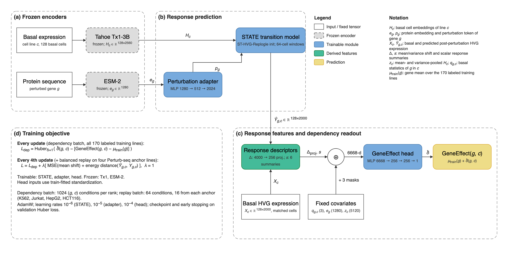
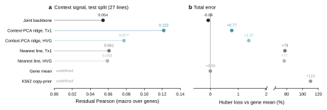

# Experiment Protocol: Held-Out-Cell-Line GeneEffect Prediction

Updated 2026-09-30. This is the protocol for the **implemented** GeneEffect track under
[the research blueprint](01-blueprint.md) §3–§4 and §6. Implementation settings live in
the [joint-training design](specs/2026-09-06-modular-joint-training-design.md) and
operating commands in the [runbook](../hpc/README.md). One run has completed: seed 0,
trained, tested and baselined ([result](results/joint_geneeffect_seed0/README.md)). The
current best model is that backbone frozen under an explicit gene-specific context-slope
head (§7, validation only). A numeric-space defect in response preparation was found and
corrected. After the correction, the response pathway learns the cell lines it is adapted
on but does not transfer to a held-out line
(§8, [result](results/p1_response_pathway_diagnostics/README.md)). The
[SL ranking protocol](04-sl-ranking-protocol.md) builds on this backbone; nothing here
is SL evidence.

## 1. Objective and prediction unit

For a held-out cell line $c$ and gene $g$, predict the DepMap GeneEffect $y_{g,c}$
from the basal single-cell transcriptome of $c$ and the protein sequence of $g$.
The model predicts the residual over a fixed training gene mean,

$$
\hat y_{g,c}=\mu_{\text{train}}(g)+\hat\delta(g,c),\qquad
\mu_{\text{train}}(g)=\operatorname{mean}_{c\in\mathcal C_{\text{train}}}y_{g,c},
$$

so that the context-blind term is fixed preprocessing and the residual is the
quantity under test. The generalization axis is the cell line, not the gene. No
GeneEffect measurement of $c$ enters the deployable feature path. GeneEffect is a
single-gene dependency: it is not an SL label and estimates no genetic interaction.

The question this protocol answers is whether a perturbation-response model learns
context information that improves held-out-line dependency prediction beyond the
gene mean and simple context predictors. It is a diagnostic for the backbone, scored
on its own benchmark, and does not substitute for the SL protocol's pair evaluation.

## 2. Benchmark

The [fixed split](../configs/benchmarks/cell_line_geneeffect_226_split.json) is the
sole membership authority; the [data card](data/cell-line-geneeffect-226.md)
documents its construction.

| Cohort | Members | Labeled | Role |
| --- | ---: | ---: | --- |
| train | 172 | 170 | supervised fitting; PC9 and HeLa have no 26Q1 GeneEffect row |
| validation | 27 | 27 | once-per-epoch evaluation, checkpoint selection, early stopping |
| test | 27 | 27 | one-shot final evaluation |

All 47 original basal/SL-context union lines are fixed in train. The 179 atlas lines
follow a patient-grouped partition: no patient's lines are split across cohorts, and
GeneEffect values did not determine membership. The 226-line benchmark and the
nine-context SL split never substitute for each other.

## 3. Inputs and supervision

### 3.1 Basal cells

Use each line's basal cells as raw UMI counts, never CPM: Tx1 does not read CPM the way
it reads the counts underneath, and the shift survives pooling
([measured](results/exp13_stage0/README.md)). A fixed random sample of up to 128 basal
cells per line is encoded once by the frozen Tx1-3B foundation model.

### 3.2 Response anchors

Four labeled training lines carry genetic-perturbation response data: K562, HCT116,
Jurkat and HepG2, joined by DepMap ModelID. Use genetic-perturbation responses and
non-targeting controls; a response condition need not carry a GeneEffect observation.
A fixed 10% of each anchor's response conditions is withheld from optimization and
scored at validation and test. This is condition holdout on training lines, not
cell-line or unseen-gene holdout.

### 3.3 Dependency labels

Use the pinned DepMap 26Q1 GeneEffect release, joined by ModelID. Fit the gene mean, the
variable-gene set and all normalization on the 170 labeled training lines only, and
reuse them unchanged in every later evaluation. Test values never enter preparation or
fitting. Missing labels stay missing.

## 4. Model

*Figure 1. (a) Frozen Tx1-3B encodes the sampled basal cells of line $c$ and frozen ESM-2
encodes gene $g$. Both are computed once and cached. (b) A trainable adapter turns the
gene embedding into a perturbation token. The trainable STATE transition model,
initialised from a published Replogle checkpoint, predicts the line's post-perturbation
expression. (c) Response descriptors summarise how predicted expression differs from
basal expression. With the pooled context embedding, the gene embedding and basal
statistics of $g$ in $c$, they feed a small residual head. (d) The joint objective of §5.*

Predicted and basal expression are compared in one shared gene space. Cell distributions
are supervised as distributions, without pairing individual control and perturbed
cells. Covariates that are unavailable for a gene or line are masked, never zero-filled.

## 5. Training and selection

A single joint training loop runs. Every update minimizes the mean GeneEffect Huber
loss on $\hat\delta$ against $y-\mu_{\text{train}}$. Every fourth update also adds a
response batch balanced across the four anchors:

$$
L_t=L_{GE}+\mathbf{1}[t\bmod4=0]\,\lambda\,\big(L_{\text{mean-shift MSE}}+L_{\text{energy distance}}\big),\qquad \lambda=1.
$$

The pretrained STATE model is updated most cautiously and the new residual head fastest.
Validation runs once per epoch over all 27 validation lines and the withheld response
conditions. **Only validation GeneEffect Huber loss selects the checkpoint and controls
early stopping**; total loss, response loss and correlations are reported diagnostics.
Learning rates, batch sizes, patience and seeds are fixed in the
[joint-training design](specs/2026-09-06-modular-joint-training-design.md).

## 6. Evaluation

Evaluate the selected checkpoint with the training-side gene mean and normalization
restored. Train and validation use their own observed cell-line/gene pairs and the same
train-defined variable-gene set. Let $y_{cg}$ be the observed GeneEffect, $\mu_g$ the
fitted training gene mean, $r_{cg}=y_{cg}-\mu_g$ the target residual and $\hat r_{cg}$
the predicted residual.

### Residual Pearson ↑

For each variable gene, compute Pearson correlation across cell lines, then take
an equal-weight mean over genes with defined correlations:

$$
\rho_g=\operatorname{Pearson}_c(r_{cg},\hat r_{cg}),\qquad
\rho_{\mathrm{macro}}=\frac{1}{|G_\rho|}\sum_{g\in G_\rho}\rho_g.
$$

This measures how well predictions follow gene-specific context variation. The reported
set contains 4,447 train-defined variable genes; undefined correlations are excluded
and counted. A context-blind predictor, such as the gene mean, is constant per gene, so
its residual correlation is undefined rather than zero.

### SD ratio

For each variable gene, divide prediction SD by target residual SD across cell lines,
then average the defined ratios equally:

$$
q_g=\frac{\operatorname{SD}_c(\hat r_{cg})}{\operatorname{SD}_c(r_{cg})},\qquad
q_{\mathrm{macro}}=\frac{1}{|G_q|}\sum_{g\in G_q}q_g.
$$

A ratio below 1 indicates shrinkage; 1 indicates matching amplitude.

### GeneEffect Huber ↓

For $e_{cg}=\hat r_{cg}-r_{cg}$, use Huber loss with $\delta=1$:

$$
\ell(e)=\begin{cases}
\tfrac12 e^2,& |e|\le1,\\
|e|-\tfrac12,& |e|>1,
\end{cases}
\qquad
L_{\mathrm{GE}}=\frac{1}{|\Omega|}\sum_{(c,g)\in\Omega}\ell(e_{cg}).
$$

$\Omega$ contains all labeled pairs in the split, including genes outside the
variable-gene set, each with equal weight. It excludes response loss and is the
selection criterion of §5.

## 7. Results

The best model to date is the selected seed-0 joint backbone, frozen, read out by a
residual head that adds an explicit gene-specific context slope to the §4 head:

$$
\hat\delta(g,c)=\mathrm{MLP}(F_{g,c})+w_g^{\top}u_c,
$$

where $u_c$ holds the first eight principal components of the pooled Tx1 context
embedding, fitted on training lines, and $w_g$ is one regularised slope per
training-covered gene. The head sees the context embedding, gene embedding and basal
covariates; the backbone's response block is excluded. Selection follows §5. The model
is validation-selected and carries **no test number**: the test split was spent once on
the backbone (§7.3) and has not been opened for any readout. Provenance and the full
numbers: [readout and response diagnostics](results/p1_response_pathway_diagnostics/README.md).
All result figures are drawn from tracked evidence by
[`plot_geneeffect_protocol.py`](figures/plot_geneeffect_protocol.py).

### 7.1 Learning curves

*Figure 2. Readout training on the frozen backbone, head seed 0, one point per epoch. (a)
Validation GeneEffect Huber loss, the selection criterion; the ring marks the selected
epoch and the dashed line the gene mean. (b, c) Validation and training residual
Pearson over the 4,447 train-defined variable genes; the dashed line in (b) is the
eight-component context-PCA ridge. Both readouts start from identical MLP weights and
see identical cached features; the explicit slope is the only difference.*

The explicit slope reaches the level of the linear context baseline within three epochs;
the shared MLP stays at less than half of it. Training correlation keeps rising with no
further validation gain, so the readout fits gene-by-context structure that does not
transfer beyond what the first epochs capture. Validation Huber turns upward after the
selected epoch while residual Pearson holds. The backbone's own curves are recorded with
the [joint result](results/joint_geneeffect_seed0/README.md).

### 7.2 Validation comparison with controls

*Figure 3. All methods share the same 479,084 observed cell-line/gene pairs over the 27
validation lines and the same variable-gene set; readouts consume identical cached
features. (a) Residual Pearson; open circles are two further head initialisations. (b)
Huber loss relative to the gene mean. (c) SD ratio. (d) Paired differences in residual
Pearson, 1,000 bootstrap resamples of the 27 validation lines, 95% intervals.*

The explicit slope recovers more than twice the context signal of the shared MLP and the
backbone's own readout, and it reproduces at every head initialisation. It is
indistinguishable from the eight-component context-PCA ridge and predicts with smaller
amplitude. Adding the backbone's response block changes nothing under either readout.
Huber differences stay below 1% of the gene mean's loss, so the context signal is
small against the gene-mean component.

This is a validation-only readout result on a backbone trained before the numeric-space
correction of §8. It licenses no context-modelling claim beyond an eight-component
linear context baseline and no SL claim.

### 7.3 Backbone test record

*Figure 4. The joint backbone (seed 0, selected at epoch 3) and its baseline ladder on the
test split, evaluated once. (a) Residual Pearson; the gene mean and the K562 copy-prior
are constant per gene, so their residual correlation is undefined. (b) Huber loss
relative to the gene mean, with a broken axis.*

The test split is spent and has not been used to choose or score any readout. The
backbone improves on the gene mean by 0.08% Huber and trails both contextual ridge
baselines on residual correlation. Its training was a documented mixed continuation:
the first two epochs ran at a smaller batch than the rest
([full result](results/joint_geneeffect_seed0/README.md)).

### 7.4 Prediction diagnostics

The backbone's test predictions are strongly shrunk and low-rank. The median per-gene
ratio of prediction spread to true residual spread is 5.8%, against 25.3% for the Tx1
ridge. The first singular direction of the centred prediction matrix carries 59% of its
energy, against 43% for the ridge and 11% for the true residuals. The ridge has the
higher per-gene correlation on 60% of variable genes. On training lines the backbone
reaches residual Pearson 0.165, falling to 0.040 on validation. Weak context correlation
and heavy shrinkage are already present in the fit; generalisation loses the rest.

## 8. Where the model stalls: response-pathway diagnostics

Three closed diagnostics on the selected backbone locate the bottleneck. Designs are
under [`specs/`](specs/); evidence and provenance are in the
[result note](results/p1_response_pathway_diagnostics/README.md). All are validation
only, single training seed, and none is SL evidence.

**Numeric-space correction.** The seed-0 backbone was trained on response data cached
as raw counts, whereas the pretrained STATE model expects log-normalised expression. Its
response block therefore made no detectable use of perturbation identity and scored
about 21 times the no-change reference on its own anchors' withheld conditions.
Preparation now puts the response data in the model's own space (§3.4). There, the
released checkpoint, untrained, beats no-change on HepG2 and Jurkat and uses perturbation
identity for 22–66% of its loss. It remains 25% above no-change on K562 and fails
on HCT116 at every scale, a platform mismatch for that anchor rather than a scale issue.
The results below use the corrected preparation.

**No interface transfers across cell lines.** With the backbone otherwise frozen, four
interfaces between the Tx1 context representation and the response model were adapted
on three anchors and scored on the fourth, holding out each anchor in turn.

*Figure 5. Response loss on the held-out anchor divided by the no-change reference, in
the model's own expression space; below 1 beats no-change. Each marker is one held-out
line. The black tick is the pooled ratio across the four lines; its 95% interval (1,000
paired gene resamples) is narrower than the tick. The untrained released checkpoint is the
reference row and has no pooled value.*

Every interface learns its three source anchors, most below no-change, yet none meets
the pre-registered keep rule on the held-out line. Two regularities emerge. First, the
held-out error grows with how much of STATE's basal pathway is trained on Tx1 input: a
fully new Tx1 encoder fails by 18–33 times, an added Tx1 context term by 6–13 times, and
the native path with nothing trained there sits near parity except on HCT116. The
Tx1-conditioned part learns a per-line offset that does not exist for an unseen line.
Second, the expression-residual interface routes known basal expression around that
pathway. It removes the failure entirely but transfers no effect: it uses perturbation
identity for only 2–3% of its held-out loss, and a constant global-mean shift matches
or beats it on three of four lines. Repeating the comparison in count space gives the
same ordering with larger failures, and the interface learning rate does not change the
picture.

**The readout is not the limit.** The explicit context slope of §7 lifts validation
residual Pearson from 0.05 to 0.13 at three head initialisations, ties an
eight-component linear context baseline, and gains nothing from the response block
under either readout. The context information reachable through the pooled Tx1 embedding
is low-rank, and the response block adds none because the response pathway that feeds
it does not generalise. A readout on response features from the corrected pathway has not
been trained; on the transfer evidence above it is not expected to move the residual
correlation.

**Bottleneck.** The GeneEffect residual is small against the gene mean and is sampled
on 170 training lines, so gene-by-context parameters overfit within three epochs. The
pooled Tx1 context carries about as much usable signal as eight principal components.
The perturbation-response model, meant to supply mechanism, does not transfer to a
cell line outside its adaptation set with three usable anchors. Progress requires either
a response model that holds up on a held-out line or a richer context representation;
further head engineering on the present features cannot move the residual correlation.

**Scope of the records.** Diagnostics run before the correction are retained as the
record of the defect and are never pooled with corrected runs. The backbone's test
record in §7.3 predates the correction and stands as the GeneEffect record; its response
losses carry no response-quality meaning. Any re-training of the joint backbone follows
the corrected preparation of §3.4.

## 9. Future work

The next round targets the readout objective before any further architecture. The
learning curves of §7.1 show validation Huber overfitting from epoch 3 while residual
Pearson holds. The Huber criterion is dominated by the gene-mean component, with a
context signal of order $10^{-4}$ of its value. It weights genes by residual variance
where the metric weights them equally, and selecting on it keeps the earlier, more
shrunk model. The plan in
[readout objective and selection](specs/2026-09-10-readout-objective-and-selection-design.md)
therefore proceeds in four tiers, on the frozen backbone and cached features until a
response model that transfers exists:

1. **Objective and selection.** Select on validation residual Pearson; train on per-gene
   standardised residuals or a correlation-aligned loss; calibrate amplitude per gene on
   the training side; sweep regularisation and component count; ensemble head seeds.
   Each arm is kept only if it beats the incumbent under a paired 27-line bootstrap and
   agrees at two further head seeds. Changing the selection rule amends blueprint §4 in
   place, by the owner.
2. **Context representation.** Basal-expression components, per-cell Tx1 embeddings
   with learned pooling, and gene-neighbourhood covariates, each scored against the
   expression-only control so that any Tx1 claim is earned.
3. **Response model.** Only a response model that beats no-change on a held-out anchor
   under the corrected preparation re-enters the feature path; the expression-residual
   interface with more anchors is the first candidate.
4. **Seeds and the test split.** Three training seeds before any further test use. The
   test split reopens once, with the baseline ladder, only for a validation-kept model
   that beats the context ridge by at least +0.02 residual Pearson, with an interval
   excluding 0, at all three seeds.
