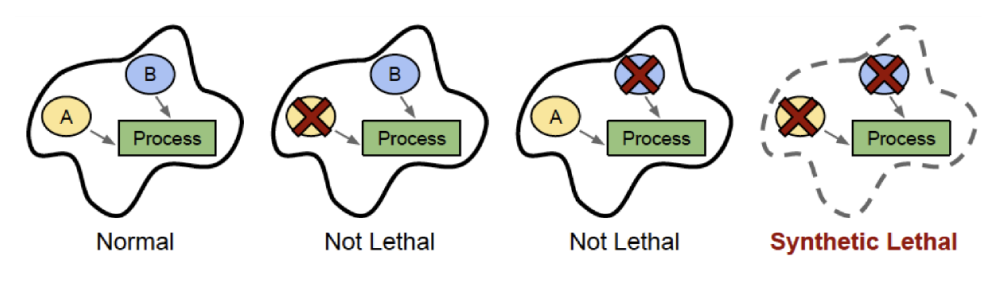

# From SL Promise to an Honest Ranking Model

### Ranking candidate synthetic-lethal gene pairs in K562

Combining DepMap dependency, Perturb-seq response, and a frozen perturbation foundation model

<!-- _notes (中文):
开场一句话定位：我们做的是在 K562 细胞系里，对候选「合成致死」基因对做排序。
方法上把三种证据结合起来——DepMap 依赖性、Perturb-seq 扰动转录组、以及一个冻结的扰动基础模型 STATE。
强调这是一个「诚实的排序模型」，后面会反复回到「诚实」这个主题：这是 benchmark 上的基因对排序/分类，不是真正的 SL 靶点发现。
计时：约 30 秒，快速进入第 2 页。
-->

---

## What is synthetic lethality — and why it's hard

- **SL**: losing either gene alone is tolerated; losing **both** kills the cell
- One gene already inactivated in the tumor → its SL partner becomes a selective drug target
- Clinical proof: **PARP inhibitors in BRCA1/2-mutant tumors**
- The bottleneck: **~200M human gene pairs**, mostly **context-dependent** — can't brute-force experimentally
- → we need a computational way to **rank** candidate partners

<!-- _notes (中文):
先讲概念：两个基因，单独敲掉任何一个细胞都能活，但同时敲掉就死——这就是合成致死。
癌症里常常有一个基因已经被突变失活了，那么它的 SL 搭档就成了选择性药物靶点。
最经典的临床证据是 BRCA1/2 突变肿瘤里的 PARP 抑制剂。
难点在于：人类大约有两亿个基因对，而且 SL 关系高度依赖细胞背景（cell context），实验上不可能穷举。
所以需要计算方法来做候选搭档的排序。这一页为后面所有实验立motivation。
计时：约 1 分钟。
-->
