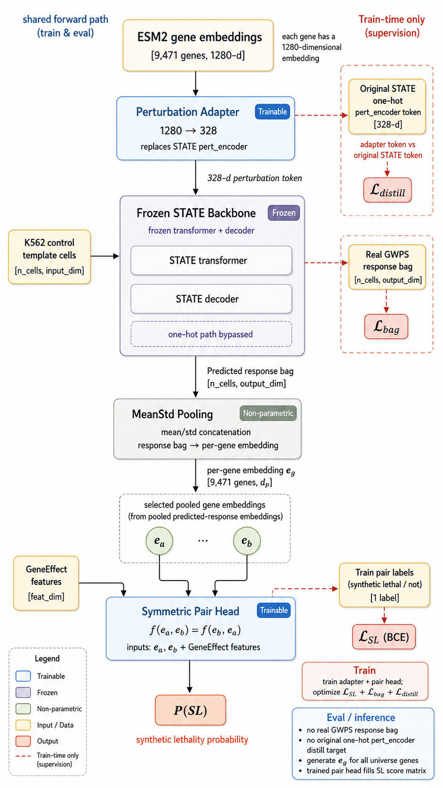

# From SL Promise to an Honest Ranking Model

### Ranking candidate synthetic-lethal gene pairs in K562

Combining DepMap dependency, Perturb-seq response, and a frozen perturbation foundation model

<!-- _notes (中文):
开场一句话定位：我们做的是在 K562 细胞系里，对候选「合成致死」基因对做排序。
方法上把三种证据结合起来——DepMap 依赖性、Perturb-seq 扰动转录组、以及一个冻结的扰动基础模型 STATE。
强调这是一个「诚实的排序模型」，后面会反复回到「诚实」这个主题：这是 benchmark 上的基因对排序/分类，不是真正的 SL 靶点发现。
计时：约 30 秒，快速进入第 2 页。
-->

---

## What is synthetic lethality — and why it's hard

- **SL**: losing either gene alone is tolerated; losing **both** kills the cell
- One gene already inactivated in the tumor → its SL partner becomes a selective drug target
- Clinical proof: **PARP inhibitors in BRCA1/2-mutant tumors**
- The bottleneck: **~200M human gene pairs**, mostly **context-dependent** — can't brute-force experimentally
- → we need a computational way to **rank** candidate partners

<!-- _notes (中文):
先讲概念：两个基因，单独敲掉任何一个细胞都能活，但同时敲掉就死——这就是合成致死。
癌症里常常有一个基因已经被突变失活了，那么它的 SL 搭档就成了选择性药物靶点。
最经典的临床证据是 BRCA1/2 突变肿瘤里的 PARP 抑制剂。
难点在于：人类大约有两亿个基因对，而且 SL 关系高度依赖细胞背景（cell context），实验上不可能穷举。
所以需要计算方法来做候选搭档的排序。这一页为后面所有实验立motivation。
计时：约 1 分钟。
-->

---

## The task we actually solve (and what we don't claim)

**Benchmark:** Feng et al. 2024, SynLethDB-derived · `Rand` 1:1 balanced · 9,471-gene K562 universe

| Split | Held out | Difficulty |
| --- | --- | --- |
| CV1 | pair-level (genes may recur) | easiest, **degree-gameable** |
| CV2 | one gene unseen | intermediate |
| CV3 | both genes unseen | cold-start, hardest |

- This is **SL-pair classification / ranking**, *not* validated SL target discovery
- `Rand` negatives are **unconfirmed** non-SL → benchmark adapter, not a K562 SL assay
- **CV2 / CV3 are the only honest generalization surfaces**

<!-- _notes (中文):
这一页是整个报告的「诚实声明」，非常重要。
我们用的是 Feng 2024 的 benchmark，来自 SynLethDB，Rand 1:1 平衡负样本，K562 过滤后是 9471 个基因的候选空间。
三种切分：CV1 是基因对层面切分，基因还会在训练集出现，最简单，而且可以被「度数」shortcut 钻空子；CV2 一个基因没见过；CV3 两个基因都没见过，是冷启动、最难。
必须反复强调：我们做的是基因对的分类/排序，不是真正的 SL 靶点发现。Rand 负样本是「未确认」的非 SL，所以这是一个 benchmark 适配器，不是 K562 的 SL 实验验证。
结论：只有 CV2/CV3 才是诚实的泛化评估面。后面所有模型都用这个标准来judge。
计时：约 1 分钟。
-->

---

## Data sources — and why each one

| Source | Role | Why |
| --- | --- | --- |
| **DepMap** CRISPRGeneEffect (Chronos) | dependency label `C` | population fitness; K562 = `ACH-000551` |
| **Replogle K562 gwps** Perturb-seq | transcriptomic response | **CRISPRi = loss-of-function**, modality-aligned with DepMap KO; 1.99M cells, 6,070 genes |
| **ESM2-650M** protein embeddings | gene identity | continuous → generalizes to **held-out** genes (1280-d) |
| **Feng 2024 / SynLethDB** | pair label `D` | the SL-pair benchmark |

**Why K562:** the only cell line with both deep Perturb-seq *and* DepMap dependency.

<!-- _notes (中文):
四个数据源，逐个讲为什么选它。
DepMap 的 CRISPRGeneEffect（Chronos 分数）是我们的依赖性标签 C，群体层面的适应度读出，K562 对应 ACH-000551。
Replogle K562 gwps 是全基因组 Perturb-seq，关键是它是 CRISPRi，也就是功能缺失，和 DepMap 的基因敲除模态一致；约 199 万个细胞，覆盖 6070 个基因。
ESM2-650M 蛋白质 embedding 提供基因身份的连续表示，这点对后面 exp08 处理没见过的基因至关重要，是 1280 维。
Feng 2024/SynLethDB 提供基因对标签 D。
为什么选 K562：它是唯一同时有深度 Perturb-seq 和 DepMap 依赖性数据的细胞系。
计时：约 1 分钟。
-->

---

## Stage 1 — observed transcriptome predicts dependency

**exp01:** pseudobulk Δ-expression → PCA + Ridge

- Replogle 5-fold CV ≈ **0.49** Spearman · Adamson transfer **0.50** (AUROC 0.886)

**exp02 audit:** is it just a generic cell-death / viability axis?

- NAR viability score alone **0.244** vs best pseudobulk **0.494**
- NAR-residualized transcriptome still **0.503** → signal is **real and transcriptomic**, not just "everything dies"

<!-- _notes (中文):
Stage 1 回答一个前提问题：观测到的扰动转录组到底能不能预测 DepMap 依赖性分数？
exp01：用 pseudobulk 的 delta 表达，做 PCA + Ridge，Replogle 五折交叉验证大约 0.49 Spearman，迁移到 Adamson 数据是 0.50，AUROC 0.886。说明这个桥是通的。
exp02 是一个审计：会不会模型只是学到了一个「细胞快死了 / 增殖快慢」的通用轴？
我们用 NAR 死亡signature 分数单独做，只有 0.244；而最好的 pseudobulk 是 0.494。把 NAR 轴残差掉之后，转录组仍然有 0.503。
结论：信号是真实的、转录组特异的，不是单纯的「泛死亡」效应。这给后面用转录组特征做铺垫。
计时：约 1 分钟。
-->

---

## Stage 2 — learning a dependency-aware representation  ⟵ *the bridge*

- **exp03** single-cell set learning: scVI128 + **frozen-GMM distribution regression** wins
  - Adamson Spearman **0.666**, AUROC **0.911** — beats attention MIL; HVG hurts
- **exp04** leakage-free *predicted-B* loop (forward A→B→C, no observed test bag)
- **exp05** frozen-**STATE** forward model (Arc Institute), A→B→C pipeline

**Takeaway:** we now have a **STATE-based way to turn any perturbation into a dependency-aware embedding** → carry this into the SL-pair task.

<!-- _notes (中文):
这一页是承上启下的「桥」，很关键。
exp03：从 pseudobulk 升级到单细胞集合学习（set learning / MIL）。结论是 scVI128 加上冻结 GMM 的分布回归效果最好，Adamson Spearman 0.666，AUROC 0.911，比 attention MIL 还好；用 HVG 反而更差。
exp04：一个无泄漏的 predicted-B 流程，前向 A→B→C，不用测试基因的观测响应包。
exp05：接上 Arc Institute 的 STATE 前向模型，做 A→B→C。
最关键的 takeaway：我们现在有了一种基于 STATE 的方法，可以把任意扰动变成一个「依赖性感知」的 embedding。这个能力会被带到后面的 SL 基因对任务里——这就是 representation-as-bridge 的核心。
计时：约 1 分钟。
-->

---

## Stage 3 — the dependency-only floor (exp06)

**Input:** only the two genes' DepMap GeneEffect scalars → 5 swap-invariant features → P(SL)

| Model | CV1 NDCG@10 | CV2 AUROC | CV2 NDCG@10 | CV3 AUROC | CV3 NDCG@10 |
| --- | ---: | ---: | ---: | ---: | ---: |
| B (XGBoost) | 0.0505 | **0.704** | **0.042** | **0.596** | 0.002 |
| C (degree probe) | **0.197** | 0.500 | 0.001 | — | — |

- Degree probe **wins CV1** → CV1 is gameable by train-positive degree
- CV3 ≈ cold-start failure for dependency-only features
- **This is the bar every later model must beat — on CV2/CV3**

<!-- _notes (中文):
进入 Stage 3，正式切换到「基因对」任务。
exp06 是最朴素的 floor：只用两个基因的 DepMap GeneEffect 标量，构造 5 个对称特征（min/max/sum/product/|diff|），预测 P(SL)。
看表：XGBoost（模型 B）在 CV2 AUROC 0.704、NDCG@10 0.042；到 CV3 掉到 AUROC 0.596、NDCG@10 0.002，基本是冷启动失败。
模型 C 是「度数 degree probe」对照：它在 CV1 的 NDCG@10 高达 0.197，说明 CV1 可以靠训练正样本的度数被钻空子——所以 CV1 不算数。
核心信息：exp06 就是后面所有模型必须超越的「门槛」，而且必须在 CV2/CV3 上超越。
计时：约 1 分钟。
-->

---

## Does observed Perturb-seq add lift over dependency-only? (exp07)

**Method:** augment exp06 (GeneEffect features) with **observed gwps response embeddings** per gene

**Coverage crux:**
- Replogle K562 gwps: **64% per-gene coverage** (6,070 / 9,471 genes)
- But for *pairs*: **~41% both-covered** under independence → 59% hit a fallback

**Two tiers:**
- Tier 1: PCA/HVG mean-pool
- Tier 2: frozen exp03 scVI representation

**Honest design:** covered-pair diagnostic slice + with/without coverage flag

**Status:** *results pending* — negative result is publishable and informative.

<!-- _notes (中文):
exp07 问：观测到的 Perturb-seq 响应能不能在 exp06 基础上带来提升？
方法：给 exp06 的 GeneEffect 特征加上每个基因的观测 gwps 响应 embedding。
覆盖率的坑：Replogle gwps 单基因覆盖是 64%（6070/9471），但这是「基因对」任务——如果两个基因独立，双覆盖只有大约 41%，剩下 59% 的对会碰到 fallback。
两层实现：Tier 1 是 PCA/HVG 均值池化；Tier 2 复用 exp03 的冻结 scVI 表示。
诚实设计：报告双覆盖对的 diagnostic slice，以及有/无覆盖标志的 ablation，确保提升不是 coverage indicator 带来的 shortcut。
状态：结果 pending。如果是负结果（没提升），也是可发表的、有信息量的——说明在 41% 覆盖率下，转录组信号不足以超越依赖性标量。
计时：约 1 分钟。
-->

---

## e2e DL centerpiece pt.1 — the problem & architecture (exp08)

**Why exp08:** local STATE checkpoint is **closed-vocab one-hot**
- Only **16.3% of the SL universe in-vocab** (1,542 / 9,471 genes)
- 84% out-of-vocab → held-out genes get no gradient

**Fix:** freeze STATE's 8-layer Llama backbone, **replace** its one-hot `pert_encoder` with a trainable **adapter fed by ESM2** (1280 → 328)

→ all 9,471 genes land in **one coordinate system**

**Arch:** ESM2 → PertAdapter → frozen STATE → predicted bag → pooling → symmetric pair head

<!-- _notes (中文):
exp08 是这次报告的中心，两页幻灯片。第一页讲问题和架构。
为什么要做 exp08：我们本地的 STATE checkpoint 是封闭词表的 one-hot 模型——只有 16.3% 的 SL 宇宙（1542/9471 基因）在词表里，84% 是 out-of-vocab。对于 CV2/CV3 那些没见过的基因，one-hot 没法给梯度。
修复方案：冻结 STATE 的 8 层 Llama backbone，只替换它的 one-hot pert_encoder，换成一个可训练的 adapter，输入是 ESM2 蛋白质 embedding（1280 维到 328 维）。
这样所有 9471 个基因——包括没见过的——都能落在同一个坐标系里。
架构流：ESM2 → PertAdapter → 冻结 STATE → 预测响应包 → pooling → 对称基因对 head。
右边的图展示整个流程。
计时：约 1.5 分钟（exp08 两页共 3 分钟）。
-->

---

## e2e DL centerpiece pt.2 — leakage-safe training & the bar

**3-part loss:**
1. **SL BCE** (pair classification)
2. **Adapter token-distill** (align adapter output to STATE's in-vocab tokens where available)
3. **Real-bag supervision** (covered *train* genes only)

**Leakage rule** that makes CV2/CV3 valid:
- Held-out genes reached **purely** via `adapter(ESM2)` + frozen STATE
- Never supervised by their own observed response bag → genuinely unseen

**The bar to beat:** exp06 CV2 AUROC **0.704** / CV3 **0.596**, with lift concentrated on covered-pair slice

**Status:** code + unit tests complete; **CV2/CV3 cluster gates pending**

<!-- _notes (中文):
第二页讲训练和评估。
三部分 loss：SL BCE 做基因对分类；adapter token-distill 让 adapter 输出对齐 STATE 词表内的 token（在有的地方）；real-bag supervision 只用覆盖的训练基因的真实响应包。
泄漏规则（让 CV2/CV3 有效）：held-out 基因纯粹通过 adapter(ESM2) + 冻结 STATE 到达，从来不用它自己的观测响应包做监督——所以是真的没见过。
必须超越的 bar：exp06 的 CV2 AUROC 0.704 / CV3 0.596，而且提升要集中在双覆盖对的 slice 上。
状态：代码和单元测试都完成了，CV2/CV3 的集群 gate 还在 pending（诚实）。
计时：约 1.5 分钟。
-->

---

## A parallel route — cross-cell-line selectivity (exp09)

**No transcriptome:** use DepMap across **1,208 lines** — is KO(b) more lethal where gene_a is defective?

**Composite-OR defective call:** mutation / CN loss / low expression

**Results:**
- CV2 B_xcl: AUROC **0.742** (+0.039 over B), NDCG@10 **0.086** (+0.044)
- CV3 B_xcl: AUROC **0.645** (+0.050), but NDCG@10 **flat** (0.001 vs 0.002)

**Read:** cross-cell-line selectivity improves cold-start **classification** but does not fix cold-start **ranking**

**Non-pan-essential slice:** lift shrinks but doesn't vanish on CV1/CV2; CV3 mostly essentiality-linked

<!-- _notes (中文):
exp09 是一条平行路线，不用转录组，纯粹用 DepMap 的跨细胞系对比。
方法：在 1208 条 GeneEffect 细胞系上，看某个基因 a 缺陷的细胞系里，敲除基因 b 是不是更致命？
用复合 OR 判断「缺陷」：突变/拷贝数缺失/低表达，只要有一个满足就算。
结果：CV2 的 B_xcl AUROC 0.742（比 B 高 0.039），NDCG@10 0.086（高 0.044）；CV3 AUROC 0.645（高 0.050），但 NDCG@10 是平的（0.001 vs 0.002）。
解读：跨细胞系 selectivity 能改善冷启动的分类，但修不好冷启动的排序。
非泛必需 slice：提升在 CV1/CV2 缩小但不消失；CV3 的提升大部分是必需性结构，不是基因对特异的 co-dependency。
这展示了面向同一个 bar 的多种方法的广度。
计时：约 0.75 分钟。
-->

---

## Closing the loop — what we built, what we didn't claim

**Built:** an **honest, leakage-controlled SL-pair ranking adapter** (classification + ranking), not validated SL target discovery

**The recurring discipline:**
- Simple floors first (exp06 dependency-only)
- CV2 / CV3 as the real bar (CV1 is degree-gameable)
- Negative results count (if exp07/08 don't beat exp06, that's a *finding*)
- Pending is marked pending (no fabricated metrics)

**Path to true context-specific SL discovery:**
- exp08 cluster results → does frozen-STATE+ESM2 adapter generalize to held-out genes?
- exp09 selectivity → does cross-cell-line evidence add robustness?
- TCGA patient-context transfer → cell line → tumor dependency mapping

<!-- _notes (中文):
最后一页，回到开头的诚实声明。
我们建了什么：一个诚实的、泄漏可控的 SL 基因对排序适配器（分类+排序），不是真正的 SL 靶点发现验证。
反复的纪律（recurring discipline）：
- 先做简单 floor（exp06 纯依赖性）；
- CV2/CV3 才是真正的 bar（CV1 可以被度数钻空子）；
- 负结果也算数（如果 exp07/08 没超过 exp06，那也是一个发现）；
- pending 就标 pending，不编数据。
通往真正的 context-specific SL 发现的路径：
- exp08 集群结果出来后，冻结 STATE+ESM2 adapter 能不能泛化到没见过的基因？
- exp09 selectivity 能不能带来鲁棒性？
- TCGA 患者上下文迁移——从细胞系到肿瘤的依赖性映射。
结束在诚实的 scope 上。
计时：约 1 分钟。
-->

---

## Appendix — Results Scoreboard with SOTA Comparison

| Model | Source | CV1 F1 | CV1 NDCG | CV2 F1 | CV2 NDCG | CV3 F1 | CV3 NDCG |
| --- | --- | ---: | ---: | ---: | ---: | ---: | ---: |
| DDGCN | literature | 0.9104 | 0.2159 | 0.9113 | 0.2494 | 0.9104 | 0.2470 |
| GRSMF | literature | 0.8757 | 0.5178 | 0.8905 | 0.5075 | 0.8905 | 0.5075 |
| SL2MF | literature | 0.8611 | 0.2745 | 0.4332 | 0.0052 | 0.4160 | 0.0001 |
| A (logreg) | exp06 | 0.6675 | 0.0040 | 0.6677 | 0.0048 | 0.6686 | 0.0035 |
| B (XGBoost) | exp06 | 0.7304 | 0.0505 | 0.6756 | 0.0421 | 0.6701 | 0.0024 |
| C (degree probe) | exp06 | 0.8227 | 0.1970 | 0.6667 | 0.0006 | 0.6667 | 0.0008 |
| A_xcl (logreg + selectivity) | exp09 | 0.6675 | 0.0096 | 0.6676 | 0.0118 | 0.6699 | 0.0081 |
| B_xcl (XGB + selectivity) | exp09 | 0.7436 | 0.1601 | 0.6942 | 0.0864 | 0.6727 | 0.0011 |
| exp07 (observed Perturb-seq) | exp07 | pending | pending | pending | pending | pending | pending |
| exp08 (frozen-STATE + ESM2 e2e DL) | exp08 | pending | pending | pending | pending | pending | pending |

**Caveat:** Literature rows use different universe/splits/negatives — **context, not head-to-head**. Our NDCG = NDCG@10 (official per-anchor protocol). Within-harness comparison: B_xcl (exp09) lifts over B (exp06) on CV2 NDCG (0.0864 vs 0.0421).

<!-- _notes (中文):
附录页，完整的结果记分板。
文献方法（DDGCN/GRSMF/SL2MF）的 F1 很高（0.86-0.91），但它们用的是完整 SynLethDB 宇宙和它们自己的切分/负样本——不能直接比，只是提供上下文定位，不是 head-to-head leaderboard。
我们的 NDCG 是 NDCG@10（官方 per-anchor 协议）。
真正 apples-to-apples 的对比是 within-harness：B_xcl（exp09）在 CV2 NDCG 上超过 B（exp06）（0.0864 vs 0.0421）——这是同一个 harness、同一个随机状态、同一个 benchmark 的真正 ablation。
exp07/exp08 行明确标 pending。
这页不在主报告计时里，备用。
-->
