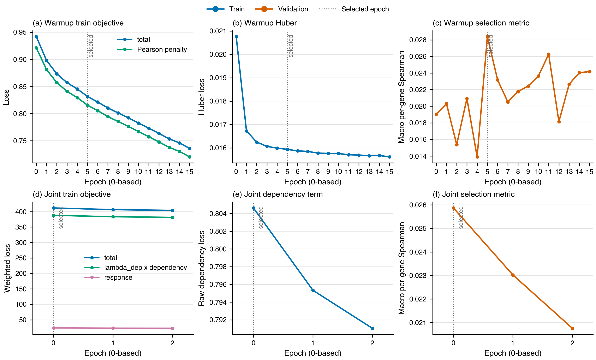

# Exp13 Formal Stage 2 GeneEffect Residual Benchmark

## Status

The one-seed 226-line Stage 2 run is complete and terminally verified. Its held-out
test result is a **negative point estimate**: the selected end-to-end model is below
both registered context-conditioned baselines on both reported rank metrics. This
does not support a positive context-prediction claim and is never SL evidence.

## What was tested

The fixed split contains 172 train, 27 validation, and 27 test cell lines over
17,787 GeneEffect genes. Stage 2 used 170 supervised train lines plus two registered
unlabelled train lines, one seed, and the full five-block model. The comparison set
is the registered residual ladder: context-PCA ridge, nearest-line, copy-prior, and
gene-mean.

## Method and provenance

- Run: `stage2_full_finalize_resume3_20260901T145000Z`, recovered for finalization
  from `stage2_full_metricfix_20260831T133606Z`.
- Training commit: `f8950c1169466234b286458705ac6da2b784a933`; final verifier:
  `f5376e2d7390c14cedb76b437c2529198ab4e3c3`.
- Hardware: 2 x H20, 2 DDP ranks, BF16.
- Selection: warmup epoch 5, then joint epoch 0, by validation macro per-gene
  Spearman. The finalization recomputation was 0.025902 versus 0.025867 in the
  selected training row, a 0.000034 difference within the registered BF16 rank-noise
  tolerance.
- Selected and packaged checkpoint SHA-256:
  `67efa21c3ba41687831d1329e0d687c7c3ab1dbb8476a952fb121329c696b949`.
- Terminal `complete.json` SHA-256:
  `1bbdf819f41c89535075b8d91e3e9e54dd58a503b0fe5ed497c1a37e49357d53`.

Historical Stage 1 training-data/code lineage remains incomplete, although the
selected checkpoint and its recorded inputs passed the current compatibility and
input seal. Tahoe-100M pretraining exposure also remains a scope qualifier.

## Learning curves



Warmup training loss decreases monotonically through epoch 15, but validation is
noisy and peaks at epoch 5 (0.028389). During joint tuning, the total, response, and
dependency losses continue to decrease, while validation Spearman decreases from
0.025867 at epoch 0 to 0.020758 at epoch 2. The registered selection therefore keeps
the first joint checkpoint rather than the lowest training-loss checkpoint.

## Result

| Method | Test macro per-gene Spearman | 95% CI | Test macro per-line Spearman | 95% CI |
| --- | ---: | ---: | ---: | ---: |
| End-to-end full | 0.022472 | not emitted | 0.021720 | not emitted |
| Context-PCA ridge | **0.085132** | [0.082183, 0.088122] | **0.099327** | [0.071360, 0.127331] |
| Nearest-line | 0.046196 | [0.043214, 0.049070] | 0.057667 | [0.032391, 0.084318] |
| Copy-prior | undefined | constant across lines | 0.005736 | [-0.012518, 0.024908] |
| Gene-mean | undefined | constant residual | undefined | constant residual |

The end-to-end point estimate trails context-PCA ridge by 0.062660 per gene and
0.077607 per line, and trails nearest-line by 0.023725 per gene and 0.035946 per
line. Twenty of 27 test lines have positive within-line Spearman, but the macro
effect is small. Test is close to validation: -0.003430 per gene and +0.000069 per
line. The 27 model-specific values are in
[`e2e_test_per_line.csv`](exp13_stage2_full/e2e_test_per_line.csv).

## Interpretation

The optimization trace rules out a simple failure to reduce the training objective:
all observed training terms fall. Instead, validation stops improving before joint
tuning and declines while training loss continues downward. On this fixed split,
the learned composition does not convert its extra machinery into better held-out
context ranking than either simple context-conditioned baseline.

No paired end-to-end-versus-baseline bootstrap interval was emitted, and only one
seed was run. The defensible conclusion is therefore a negative point estimate, not
a claim of statistical significance or multi-seed stability. The Stage 1 response
before/after records are not comparable because the historical input lineage is
incomplete; no response delta is reported.

## Verdict and scope

Formal Stage 2 completed, but it does not license a positive GeneEffect
context-prediction claim. GeneEffect is single-gene dependency, so this result is
not synthetic-lethality evidence, does not test unseen genes, and does not substitute
for `context_screen_v2`.

## Reproduction

The checked-in telemetry and metric extracts are
[`learning_curves.csv`](exp13_stage2_full/learning_curves.csv) and
[`test_results.csv`](exp13_stage2_full/test_results.csv); the model's 27 per-line test
scores are in [`e2e_test_per_line.csv`](exp13_stage2_full/e2e_test_per_line.csv).
Rebuild the figure with:

```bash
uv run python docs/results/exp13_stage2_full/plot_learning_curves.py
```

The plotting source is
[`plot_learning_curves.py`](exp13_stage2_full/plot_learning_curves.py). The source
run artifacts are the authenticated `warmup_train_log.csv`, `joint_train_log.csv`,
`geneeffect_residual_metrics.json`, `checkpoint_selection.json`, `run_manifest.json`,
and `complete.json` in the formal H20 run directory.
